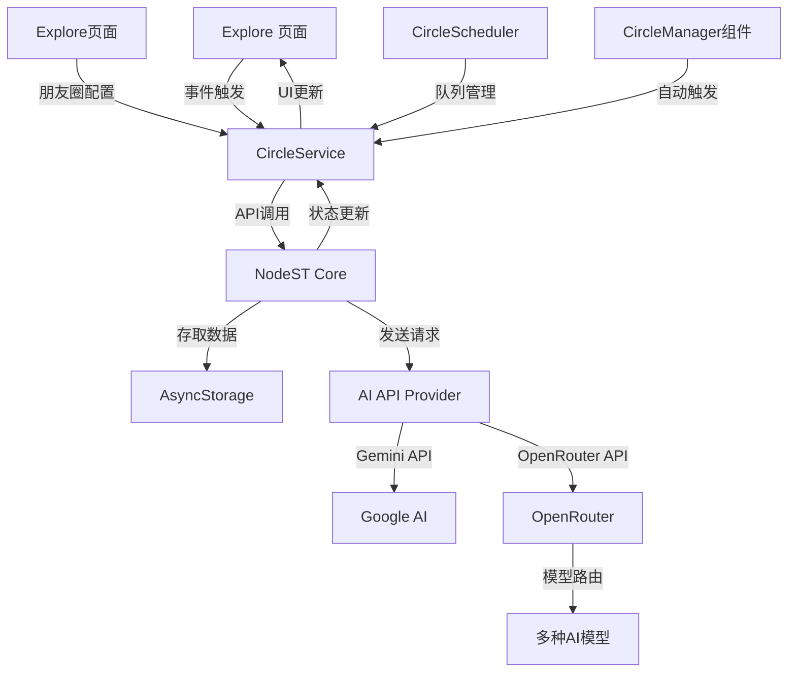

# 更新日志

## v1.3.0 (最新版本)
- 增加多轮互动支持，角色可持续参与对话线程
- 添加上下文连续性机制，确保对话前后一致
- 强化角色一致性，利用jsonData保持角色设定完整
- 新增可专为多轮对话优化的提示词模板

# 开发规范

为确保系统的一致性和可维护性，我们规定**所有**基于AI对话的扩展工具和功能**必须**使用`PromptBuilderService`构建请求体，并遵循以下规范：

## 1. 使用前置声明

在任何使用`PromptBuilderService`的模块头部进行导入和工具声明：

```typescript
import { PromptBuilderService, DEntry, RFrameworkEntry } from '../services/prompt-builder-service';
```

## 2. 坚持使用创建方法

始终使用提供的创建方法构建条目，而不是手动创建对象：

```typescript
// 正确做法
const entry = PromptBuilderService.createDEntry({
  name: "Context",
  content: "重要信息"
});

// 错误做法
const entry = {
  name: "Context",
  content: "重要信息",
  depth: 1
};
```

# 朋友圈互动系统文档

## 1. 系统概述

朋友圈互动系统是基于 NodeST 框架的扩展功能，允许角色对朋友圈内容进行自然的互动，包括发布帖子、点赞、评论和回复等社交行为。系统设计为**角色人格一致性**与**场景特定行为**之间的平衡点，保证角色在不同场景下的行为符合其设定，同时能适应多种社交互动模式。

### 1.1 核心功能

- **自动发布:** 角色可根据设定频率发布朋友圈
- **互动响应:** 对其他角色的帖子进行点赞、评论
- **评论回复:** 回复帖子下的评论，包括发帖者回复其帖子下的评论
- **频率控制:** 基于角色设置，合理控制互动频率
- **角色一致性:** 确保所有互动内容符合角色设定
- **多模型支持:** 支持 Gemini 和 OpenRouter 多种 AI 模型接口
- **图片处理:** 支持包含图片的帖子分析和互动

## 2. 系统架构

系统采用三层架构设计：
1. **UI 层**：Explore 页面、CharacterInteractionSettings组件
2. **服务层**：CircleService、CircleScheduler
3. **核心层**：NodeST 的 CircleManager 实现



### 2.1 角色身份感知机制

系统在处理朋友圈互动时，现已增强对"角色自我身份"的感知能力，特别是当角色是内容的发布者时：

1. **身份感知触发**：系统通过检测 `options.content.authorId === options.responderId` 来识别角色是否为帖子作者
2. **内容生成适配**：基于身份提供不同的提示词模板，确保输出内容的合理性
3. **提示词差异化**：发帖者、回复者、评论回复者的提示词模板分别独立设计

### 2.2 多 API 提供商支持机制

系统现在完整支持多种 API 提供商，让用户可以选择最适合的 AI 模型：

1. **Gemini API**：默认提供商，适合基本对话
2. **OpenRouter**：支持高级模型如 Claude、GPT-4 等多种选择
3. **API 设置透传**：从用户界面一直到底层 NodeST 完整传递 API 配置

## 3. 快速开始

### 3.1 启用朋友圈功能

```typescript
import { CircleService } from '@/services/circle-service';

// 初始化角色的朋友圈框架，支持API设置
const initialized = await CircleService.initCharacterCircle(
  character, 
  apiKey, 
  {
    apiProvider: 'openrouter',
    openrouter: {
      enabled: true,
      apiKey: 'your-openrouter-key',
      model: 'anthropic/claude-3-haiku'
    }
  }
);

// 创建新朋友圈帖子，支持API设置
const postResponse = await CircleService.createNewPost(character, content, apiKey, apiSettings);

// 处理角色对帖子的互动，支持图片
const response = await CircleService.processCircleInteraction(
  character, 
  post, 
  apiKey, 
  apiSettings,
  {
    type: 'replyToPost',
    content: {
      authorId: post.characterId,
      authorName: post.characterName,
      text: post.content,
      context: '这是一条朋友圈动态',
      images: ['http://example.com/image.jpg'] // 支持图片分析
    },
    responderId: character.id,
    responderCharacter: character
  }
);

// 处理角色对评论的回复
const commentResponse = await CircleService.replyToComment(
  character,
  post,
  comment,
  apiKey,
  apiSettings
);

// 处理用户评论的角色响应
const userCommentResponse = await CircleService.processCommentInteraction(
  character,
  post,
  userComment,
  apiKey,
  apiSettings,
  replyTo // 可选，回复特定评论
);
```

### 3.2 测试功能

```typescript
// 发布测试帖子，支持API设置
const { post, author } = await CircleService.publishTestPost(
  characters, 
  apiKey, 
  apiSettings
);

// 执行多角色互动测试
const { updatedPost, results } = await CircleService.processTestInteraction(
  testPost, 
  enabledCharacters,
  apiKey,
  apiSettings
);
```

## 4. API设置传递机制

系统通过完整的设置传递链确保每个组件都能正确使用配置的 API 提供商：

```typescript
// 用户配置 API 设置
const apiSettings = {
  apiProvider: 'openrouter', // 'gemini' 或 'openrouter'
  openrouter: {
    enabled: true,
    apiKey: 'your-openrouter-key',
    model: 'anthropic/claude-3-haiku'
  }
};

// CircleService 方法透传 API 设置
const result = await CircleService.createNewPost(
  character, 
  content, 
  apiKey, 
  apiSettings
);

// NodeSTManager 更新和保持 API 设置
NodeSTManager.updateApiSettings(apiKey, apiSettings);

// 底层 CircleManager 实现根据设置选择适当的适配器
if (apiSettings.apiProvider === 'openrouter' && apiSettings.openrouter?.enabled) {
  // 使用 OpenRouter 适配器
  this.openRouterAdapter = new OpenRouterAdapter(
    apiSettings.openrouter.apiKey,
    apiSettings.openrouter.model
  );
} else {
  // 使用 Gemini 适配器
  this.geminiAdapter = new GeminiAdapter(apiKey);
}
```

## 5. 核心文件与职责

### 5.1 前端 UI
- **`/app/(tabs)/explore.tsx`**：朋友圈页面，展示帖子、处理交互
- **`/components/SettingsSidebar.tsx`**：角色设置侧边栏，朋友圈启用开关
- **`/app/components/circle/CircleManager.tsx`**：管理自动帖子生成
- **`/app/pages/api-settings.tsx`**：API 设置界面，包括 OpenRouter 配置

### 5.2 服务层
- **`/services/circle-service.ts`**：中间层服务，处理业务逻辑，API设置透传
- **`/services/circle-scheduler.ts`**：管理互动队列，控制API调用频率
- **`/utils/NodeSTManager.ts`**：NodeST API 封装层，确保API设置一致传递

### 5.3 核心层
- **`/NodeST/nodest/index.ts`**：NodeST 核心入口，处理API设置更新
- **`/NodeST/nodest/managers/circle-manager.ts`**：朋友圈核心处理器
- **`/NodeST/nodest/services/prompt-builder-service`**：构建 AI 请求体的服务
- **`/NodeST/nodest/utils/openrouter-adapter.ts`**：OpenRouter API 适配器
- **`/NodeST/nodest/utils/gemini-adapter.ts`**：Gemini API 适配器

## 6. 关键接口与实现

### 6.1 朋友圈 R 框架
```typescript
interface CircleRFramework {
    base: {
        charDescription: string;    // 角色基础设定
        charPersonality: string;    // 角色性格特征
    },
    circle: {
        scenePrompt: string;        // 场景描述提示词
        responseFormat: {           // 响应格式模板
            action: {
                like: boolean;      // 是否点赞
                comment?: string;   // 评论内容（可选）
            },
            emotion: {              // 情绪反应
                type: "positive" | "neutral" | "negative";
                intensity: number;  // 0-1强度值
            }
        }
    }
}
```

### 6.2 交互选项

```typescript
interface CirclePostOptions {
    type: 'newPost' | 'replyToComment' | 'replyToPost' | 'forwardedPost';  // 交互类型
    content: {
        authorId: string;           // 帖子作者ID
        authorName: string;         // 帖子作者名称
        text: string;               // 帖子/评论内容
        context?: string;           // 上下文信息
        images?: string[];          // 图片URL数组（可选）
    };
    responderId: string;            // 响应者ID（角色ID）
    responderCharacter?: Character; // 响应者角色对象（可选，用于初始化）
}
```

### 6.3 API 设置接口

```typescript
interface OpenRouterSettings {
  enabled: boolean;              // 是否启用OpenRouter
  apiKey: string;                // OpenRouter API密钥
  model: string;                 // 选择的模型ID
  useBackupModels?: boolean;     // 是否使用备用模型（可选）
  backupModels?: string[];       // 备用模型列表（可选）
}

interface ApiSettings {
  apiProvider: 'gemini' | 'openrouter';  // API提供商
  openrouter?: OpenRouterSettings;       // OpenRouter设置（可选）
}
```

### 6.4 CircleScheduler 队列管理系统

CircleScheduler 提供了强大的队列管理功能，确保 API 调用的频率限制和任务优先级：

```typescript
class CircleScheduler {
  // 用于创建帖子的请求队列
  private postQueue: Array<{
    character: Character;
    apiKey?: string;
    apiSettings?: ApiSettings;
    // ...
  }>;
  
  // 用于互动的请求队列
  private interactionQueue: Array<{
    character: Character;
    post: CirclePost;
    apiKey?: string;
    apiSettings?: ApiSettings;
    images?: string[]; // 支持图片分析
    // ...
  }>;
  
  // 安排帖子创建任务
  public schedulePost(character, apiKey?, apiSettings?): Promise<...>;
  
  // 安排互动任务（支持图片）
  public scheduleInteraction(character, post, apiKey?, apiSettings?, images?): Promise<...>;
  
  // 优先处理用户帖子互动
  public scheduleUserPostInteraction(character, userPost, apiKey?, apiSettings?, images?): Promise<...>;
  
  // 处理队列中的任务
  private async processQueues(): Promise<void>;
}
```

## 7. 队列处理优先级

CircleScheduler 按以下优先级处理任务：

1. **用户帖子互动** - 用户创建的帖子获得最高优先级
2. **角色发帖请求** - 当没有用户帖子互动时处理
3. **普通互动请求** - 最低优先级

```typescript
// 优先处理用户帖子互动
const userPostInteraction = this.interactionQueue.find(
  item => item.post.characterId.startsWith('user-')
);

if (userPostInteraction) {
  // 优先处理用户帖子互动
} else if (this.postQueue.length > 0) {
  // 其次处理发帖请求
} else {
  // 最后处理普通互动请求
}
```

## 8. API 提供商实现

### 8.1 Gemini 适配器

```typescript
class GeminiAdapter {
  constructor(apiKey: string) {
    this.apiKey = apiKey;
  }
  
  async generateContent(messages: any[]): Promise<string> {
    const response = await fetch('https://generativelanguage.googleapis.com/v1beta/models/gemini-pro:generateContent?key=' + this.apiKey, {
      method: 'POST',
      headers: { 'Content-Type': 'application/json' },
      body: JSON.stringify({ contents: messages, generationConfig: {...} })
    });
    // 处理响应...
  }
  
  async generateMultiModalContent(prompt: string, imageData: any): Promise<{text: string}> {
    // 处理包含图片的请求...
  }
}
```

### 8.2 OpenRouter 适配器

```typescript
class OpenRouterAdapter {
  constructor(apiKey: string, model: string = 'anthropic/claude-3-haiku') {
    this.apiKey = apiKey;
    this.model = model;
  }
  
  async generateContent(messages: any[]): Promise<string> {
    const response = await fetch('https://openrouter.ai/api/v1/chat/completions', {
      method: 'POST',
      headers: {
        'Content-Type': 'application/json',
        'Authorization': `Bearer ${this.apiKey}`,
        'HTTP-Referer': 'https://my-app.com',
        'X-Title': 'My App Circle'
      },
      body: JSON.stringify({
        model: this.model,
        messages: messages.map(msg => ({
          role: this.convertRole(msg.role),
          content: msg.parts[0].text
        })),
        // 其他配置...
      })
    });
    // 处理响应...
  }
  
  // 转换Gemini角色到OpenRouter角色
  private convertRole(role: string): string {
    return role === 'user' ? 'user' : 
           role === 'model' ? 'assistant' : 
           role === 'system' ? 'system' : 'assistant';
  }
}
```

## 9. 角色互动频率设置

系统在 SettingsSidebar 中提供了发布频率和互动频率的设置：

### 9.1 发布频率

* **低**: 1次/天
* **中**: 3次/天
* **高**: 5次/天

### 9.2 互动频率

互动频率控制角色在朋友圈中的互动行为限制：

* **低频率**:
  * 最多回复同一角色的朋友圈1次
  * 最多回复5个不同角色的朋友圈
  * 最多回复朋友圈下其他角色的评论1次

* **中频率**:
  * 最多回复同一角色的朋友圈3次
  * 最多回复5个不同角色的朋友圈
  * 最多回复朋友圈下其他角色的评论3次

* **高频率**:
  * 最多回复同一角色的朋友圈5次
  * 最多回复7个不同角色的朋友圈
  * 最多回复朋友圈下其他角色的评论5次

## 10. 自动帖子管理

系统通过 CircleManager 组件实现自动的帖子生成和互动：

```typescript
export const CircleManager = () => {
  // ...existing code...
  
  // 获取API设置，确保正确使用OpenRouter
  const getApiSettings = () => {
    const apiKey = user?.settings?.chat?.characterApiKey || '';
    
    const apiSettings = {
      apiProvider: user?.settings?.chat?.apiProvider || 'gemini',
      openrouter: user?.settings?.chat?.apiProvider === 'openrouter' && user?.settings?.chat?.openrouter
        ? {
            enabled: true,
            apiKey: user?.settings?.chat?.openrouter.apiKey,
            model: user?.settings?.chat?.openrouter.model
          }
        : undefined
    };
    
    return { apiKey, apiSettings };
  };
  
  // 创建测试帖子
  const createTestPost = async () => {
    const { apiKey, apiSettings } = getApiSettings();
    const result = await CircleService.publishTestPost(
      enabledCharacters,
      apiKey,
      apiSettings
    );
    // ...处理结果...
  };
  
  // 定时生成帖子逻辑
  useEffect(() => {
    const intervalId = setInterval(() => {
      checkSchedule();
    }, 5 * 60 * 1000); // 每5分钟检查一次
    
    return () => clearInterval(intervalId);
  }, [lastPostTimestamp, isProcessing, characters]);
  
  // ...existing code...
};
```

## 11. 最佳实践与注意事项

1. **API 设置传递** - 确保从UI层到底层服务完整传递 API 设置
   ```typescript
   await CircleService.processCircleInteraction(
     character, post, apiKey, apiSettings, postOptions
   );
   ```

2. **图片处理** - 处理带图片的帖子需要使用 `multimodal` 请求
   ```typescript
   if (hasImages && this.geminiAdapter) {
     const multimodalResponse = await this.geminiAdapter.generateMultiModalContent(
       promptText,
       { images: [imageInput] }
     );
   }
   ```

3. **适配器选择** - 根据 API 设置自动选择正确的适配器
   ```typescript
   if (this.openRouterAdapter) {
     console.log('【朋友圈】使用OpenRouter适配器发送请求');
     response = await this.openRouterAdapter.generateContent([message]);
   } else if (this.geminiAdapter) {
     console.log('【朋友圈】使用Gemini适配器发送请求');
     response = await this.geminiAdapter.generateContent([message]);
   }
   ```

4. **日志记录** - 记录详细的 API 设置和适配器使用情况，方便调试
   ```typescript
   console.log(`【朋友圈服务】获取NodeST实例，apiKey存在: ${!!apiKey}，provider: ${apiSettings?.apiProvider || 'gemini'}`, 
     openRouterConfig ? {
       hasOpenRouterKey: !!openRouterConfig.apiKey,
       model: openRouterConfig.model
     } : 'no openrouter config'
   );
   ```

## 12. 故障排除

### 12.1 API 设置未正确传递

如果 OpenRouter 配置未生效，请检查设置传递链：

1. **API 设置页面** - 确认启用了 OpenRouter 开关，并正确设置了 API Key 和模型
2. **CircleService** - 查看日志确认 `apiSettings` 参数正确传递
3. **NodeSTManager** - 查看 `updateApiSettings` 是否收到并保存了设置
4. **CircleManager** - 查看适配器选择日志，确认使用了正确的适配器

### 12.2 图片处理失败

如果图片分析功能失败：

1. 检查 Gemini API Key 是否有效（OpenRouter 暂不支持图片分析）
2. 确认图片 URL 可公开访问
3. 检查图片格式是否支持（JPG, PNG, WebP）
4. 尝试降低图片分辨率（1024x1024 以下最佳）

### 12.3 频率限制问题

如果 API 调用频繁失败：

1. 增加 CircleScheduler 的 `processingInterval` 值（默认3000ms）
2. 降低角色的互动频率设置
3. 对于 OpenRouter，考虑使用备用模型选项
4. 实现更复杂的指数退避重试机制

## 13. 后续发展计划

1. **实时互动** - 引入 WebSocket 支持实时角色互动
2. **情感分析** - 基于互动内容分析角色情感，调整关系发展
3. **多模态增强** - 支持音频、视频等多种互动内容
4. **角色关系网络** - 可视化展示角色之间的社交网络和关系发展
5. **自适应交互** - 根据用户参与度自动调整互动频率和内容深度
6. **跨平台同步** - 支持多设备同步朋友圈内容和互动

## 更新日志

### v1.2.0 (当前版本)
- 新增 OpenRouter 完整支持，从UI到底层全链路透传API设置
- 改进 CircleManager 组件实现自动帖子生成
- 增强 API 设置页面，支持详细 OpenRouter 配置
- 优化 CircleScheduler 支持图片处理和API设置传递

### v1.1.0
- 新增角色身份感知机制
- 引入频率控制系统
- 实现关系影响与更新
- 添加帖子评论互动支持

### v1.0.0
- 基础朋友圈功能
- 帖子创建与互动
- Gemini API 支持
- 角色设置界面

## 14. 多轮互动与上下文连续性

朋友圈系统现已支持完整的多轮对话互动，包括以下核心功能：

### 14.1 对话线程提取

系统能自动从朋友圈帖子中提取相关的对话线程，确保上下文连贯：

```typescript
// 提取某用户参与的所有相关评论，形成对话线程
const threadComments = CircleService.extractConversationThread(post, userId);
```

### 14.2 角色记忆与上下文

角色在回复时会考虑以下上下文信息：
1. **历史对话内容** - 当前帖子下的相关历史对话
2. **角色设定信息** - 从 character.jsonData 提取的核心设定
3. **情境感知能力** - 区分不同对话场景(评论原帖/回复评论)

### 14.3 多轮互动场景

系统支持以下多轮互动场景：

1. **用户-角色对话**
   - 用户评论角色帖子 → 角色回复 → 用户再回复 → 角色持续对话
   - 系统传递完整对话历史，确保对话连贯性

2. **角色-角色对话**
   - 角色A发帖 → 角色B评论 → 角色A回复 → 角色B继续对话
   - 每次回复都基于完整对话历史

3. **多人对话**
   - 在同一个帖子下，多个角色和用户可同时参与讨论
   - 系统智能区分回复对象，保持对话关系清晰

### 14.4 互动模板优化

为支持多轮对话，新增了专门的对话模板：

```typescript
CirclePrompts.continuedConversation(params)
```

该模板具有以下特性：
- 完整包含历史对话记录
- 清晰标记当前回复对象
- 注入角色设定信息确保性格一致性
- 优化提示词结构，确保回复与历史语境一致

### 14.5 实现示例

以下是一个完整的多轮对话示例：

```typescript
// 用户对角色帖子的初次评论
const response1 = await CircleService.processCommentInteraction(
  character,
  post, 
  "我觉得你说得很有道理",
  apiKey,
  apiSettings
);

// 用户对角色回复的二次回复
const response2 = await CircleService.processCommentInteraction(
  character,
  post,
  "能详细解释一下吗？",
  apiKey,
  { userId: character.id, userName: character.name }, // 回复角色的上一条评论
  apiSettings
);

// 系统会自动提取这两次互动的内容，形成对话线程
// 角色的第二次回复会参考完整的对话上下文