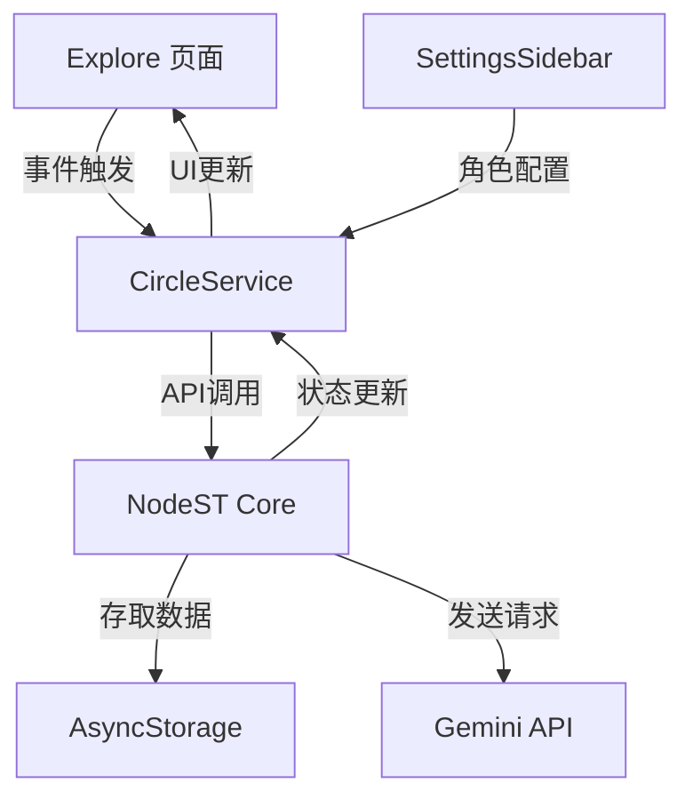

# 开发规范

为确保系统的一致性和可维护性，我们规定**所有**基于AI对话的扩展工具和功能**必须**使用`PromptBuilderService`构建请求体，并遵循以下规范：

## 1. 使用前置声明

在任何使用`PromptBuilderService`的模块头部进行导入和工具声明：

```typescript
import { PromptBuilderService, DEntry, RFrameworkEntry } from '../services/prompt-builder-service';
```

## 2. 坚持使用创建方法

始终使用提供的创建方法构建条目，而不是手动创建对象：

```typescript
// 正确做法
const entry = PromptBuilderService.createDEntry({
  name: "Context",
  content: "重要信息"
});

// 错误做法
const entry = {
  name: "Context",
  content: "重要信息",
  depth: 1
};
```

# 朋友圈互动系统文档

## 1. 系统概述

朋友圈互动系统是基于 NodeST 框架的扩展功能，允许角色对朋友圈内容进行自然的互动，包括发布帖子、点赞、评论和回复等社交行为。系统设计为**角色人格一致性**与**场景特定行为**之间的平衡点，保证角色在不同场景下的行为符合其设定，同时能适应多种社交互动模式。

### 1.1 核心功能

- **自动发布:** 角色可根据设定频率发布朋友圈
- **互动响应:** 对其他角色的帖子进行点赞、评论
- **评论回复:** 回复帖子下的评论，包括发帖者回复其帖子下的评论
- **频率控制:** 基于角色设置，合理控制互动频率
- **角色一致性:** 确保所有互动内容符合角色设定

## 2. 系统架构

系统采用三层架构设计：
1. **UI 层**：Explore 页面、SettingsSidebar 组件
2. **服务层**：CircleService
3. **核心层**：NodeST 的 CircleManager 实现



## 3. 快速开始

### 3.1 启用朋友圈功能

```typescript
import { CircleService } from '@/services/circle-service';

// 初始化角色的朋友圈框架
const initialized = await CircleService.initCharacterCircle(character, apiKey);

// 创建新朋友圈帖子
const postResponse = await CircleService.createNewPost(character, content, apiKey);

// 处理角色对帖子的互动
const response = await CircleService.processCircleInteraction(character, post, apiKey);

// 处理角色对评论的回复
const commentResponse = await CircleService.replyToComment(
  character,
  post,
  comment,
  apiKey
);

// 处理用户评论的角色响应
const userCommentResponse = await CircleService.processCommentInteraction(
  character,
  post,
  userComment,
  apiKey,
  replyTo // 可选，回复特定评论
);
```

### 3.2 测试功能

```typescript
// 发布测试帖子
const { post, author } = await CircleService.publishTestPost(characters, apiKey);

// 执行多角色互动测试
const { updatedPost, results } = await CircleService.processTestInteraction(
  testPost, 
  enabledCharacters,
  apiKey
);
```

## 4. 关键数据流

4. 关键数据流
4.1 朋友圈 R 框架切换流程

graph TD
    A[角色详情页面] -->|启用社交功能| B[调用 initCharacterCircle]
    B --> C{验证角色数据}
    C -->|验证通过| D[构建朋友圈R框架]
    D --> E[存储框架]
    E --> G[更新角色状态]


4.2 互动处理流程

graph TD
    A1[Explore页面] -->|社交事件| B1[事件类型判断]
    B1 --> C1{构建互动请求}
    C1 -->|新帖子| D1[createNewPost]
    C1 -->|回复帖子| E1[processCircleInteraction]
    C1 -->|回复评论| F1[replyToComment]
    D1 & E1 & F1 --> G1[CircleManager.circlePost]
    G1 --> H1[getScenePromptByType]
    H1 --> I1[buildCirclePrompt]
    I1 --> J1[调用LLM获取响应]
    J1 --> K1[parseCircleResponse]
    K1 --> L1[updateCircleMemory]
    K1 --> M1[更新UI]
4.3 互动频率控制流程

graph TD
    A2[互动请求] --> B2[checkInteractionLimits]
    B2 --> C2{频率设置}
    C2 -->|低| D2["最多回复同一角色1次<br>最多回复5个不同角色<br>最多回复评论1次"]
    C2 -->|中| E2["最多回复同一角色3次<br>最多回复5个不同角色<br>最多回复评论3次"]
    C2 -->|高| F2["最多回复同一角色5次<br>最多回复7个不同角色<br>最多回复评论5次"]
    D2 & E2 & F2 --> G2{检查限制}
    G2 -->|超过限制| H2[拒绝请求]
    G2 -->|限制内| I2[执行互动]
    I2 --> J2[updateInteractionStats]

## 5. 核心文件与职责
### 5.1 前端 UI
### 5.1 前端 UI

`/app/(tabs)/explore.tsx`：朋友圈页面，负责展示帖子、处理交互
'handleCirclePostUpdate'：处理帖子互动测试
'handlePublishTestPost'：处理发布测试帖子
'handleComment'：处理用户评论
'renderComment'：渲染评论组件

`/components/SettingsSidebar.tsx`：角色设置侧边栏
'CircleInteractionSettings'：朋友圈互动设置组件
'handleFrequencyChange'：处理频率设置变更

'/components/TestResultsModal.tsx'：测试结果显示组件

### 5.2 服务层
-`/services/circle-service.ts`：中间层服务，处理业务逻辑
'createNewPost'：创建新朋友圈帖子
'processCircleInteraction'：处理对帖子的互动
'replyToComment'：处理对评论的回复
'publishTestPost'：发布测试帖子
'checkInteractionLimits'：检查互动频率限制
'updateInteractionStats'：更新互动统计

`/NodeST/nodest/index.ts`：NodeST API 封装层

### 5.3 核心层
`/NodeST/nodest/services/prompt-builder-service`：# 构建 AI 请求体的核心通用服务（新增）

`/NodeST/nodest/managers/circle-manager.ts`：朋友圈核心处理器
'circleInit'：初始化角色朋友圈框架
'circlePost'：处理各类朋友圈交互
'getScenePromptByType'：根据互动类型获取场景提示词
'parseCircleResponse'：解析 AI 返回的 JSON 响应

`/NodeST/nodest/types/circle-types.ts`：相关类型定义
'CircleRFramework'：朋友圈R框架结构
'CirclePostOptions'：交互选项参数
'CircleResponse'：交互响应结构

## 6. 关键接口与实现

### 6.1 朋友圈 R 框架
```typescript
interface CircleRFramework {
    base: {
        charDescription: string;    // 角色基础设定
        charPersonality: string;    // 角色性格特征
    },
    circle: {
        scenePrompt: string;        // 场景描述提示词
        responseFormat: {           // 响应格式模板
            action: {
                like: boolean;      // 是否点赞
                comment?: string;   // 评论内容（可选）
            },
            emotion: {              // 情绪反应
                type: "positive" | "neutral" | "negative";
                intensity: number;  // 0-1强度值
            }
        }
    }
}


### 6.2 交互选项

interface CirclePostOptions {
    type: 'newPost' | 'replyToComment' | 'replyToPost';  // 交互类型
    content: {
        authorId: string;           // 帖子作者ID
        text: string;               // 帖子/评论内容
        context?: string;           // 上下文信息
    };
    responderId: string;            // 响应者ID（角色ID）
}
```

### 6.3 场景提示词设计
系统针对不同的互动类型设计了不同的场景提示词：

新帖子场景 (newPost)
```
你正在创建一条新的朋友圈动态。基于你的角色性格，请以JSON格式回应：
- 决定是否点赞（like: true/false，对自己发的内容通常为false）
- 提供一条你想发布的内容（comment字段）
- 包含你的情感反应（emotion对象，含type和intensity）

严格按以下格式回复，不要包含任何其他文字：
{
  "action": {
    "like": false,
    "comment": "你想发布的朋友圈内容"
  },
  "emotion": {
    "type": "positive/neutral/negative",
    "intensity": 0.0-1.0
  }
}
```

回复帖子场景 (replyToPost)
```
你正在浏览朋友圈中的动态。基于你的角色性格，请以JSON格式回应：
- 决定是否点赞（like: true/false）
- 可选择是否发表评论（comment字段）
- 包含你的情感反应（emotion对象，含type和intensity）

严格按以下格式回复，不要包含任何其他文字：
{
  "action": {
    "like": true/false,
    "comment": "你的评论内容（如不评论则省略此字段）"
  },
  "emotion": {
    "type": "positive/neutral/negative",
    "intensity": 0.0-1.0
  }
}
```

回复评论(replyToComment)
```
你看到一条朋友圈评论。基于你的角色性格和上下文信息，请以JSON格式回应：
- 决定是否点赞（like: true/false）
- 可选择是否回复此评论（comment字段）
- 包含你的情感反应（emotion对象，含type和intensity）

严格按以下格式回复，不要包含任何其他文字：
{
  "action": {
    "like": true/false,
    "comment": "你对评论的回复内容（如不回复则省略此字段）"
  },
  "emotion": {
    "type": "positive/neutral/negative",
    "intensity": 0.0-1.0
  }
}
```
```
```
```
```
```
```
### 6.4 角色配置
在角色设置中添加了以下朋友圈相关配置：

```typescript
interface Character {
    // ...现有属性
    circleInteraction?: boolean;                  // 是否启用朋友圈互动
    circlePostFrequency?: 'low' | 'medium' | 'high';  // 发布频率
    circleInteractionFrequency?: 'low' | 'medium' | 'high';  // 互动频率
    circleStats?: {
        repliedToCharacters: Record<string, number>;  // 已回复角色ID和次数
        repliedToPostsCount: number;                  // 已回复的不同角色帖子数
        repliedToCommentsCount: Record<string, number>; // 已回复评论ID和次数
    };
}
```
### 6.5 频率控制实现


```typescript
private static checkInteractionLimits(
  character: Character, 
  targetId: string,
  type: 'post' | 'comment'
): boolean {
  // 如果没有设置互动频率，默认为中等
  const frequency = character.circleInteractionFrequency || 'medium';
  
  // 初始化互动统计
  if (!character.circleStats) {
    character.circleStats = {
      repliedToCharacters: {},
      repliedToPostsCount: 0,
      repliedToCommentsCount: {}
    };
    return true; // 首次互动，允许
  }
  
  if (type === 'post') {
    // 检查对特定角色的回复次数
    const repliesCount = character.circleStats.repliedToCharacters[targetId] || 0;
    const maxRepliesPerCharacter = frequency === 'low' ? 1 : 
                                  (frequency === 'medium' ? 3 : 5);
    
    // 检查不同角色帖子的回复总数
    const maxDifferentCharacters = frequency === 'low' ? 5 : 
                                  (frequency === 'medium' ? 5 : 7);
    
    // 如果已达到限制，拒绝互动
    if (repliesCount >= maxRepliesPerCharacter) return false;
    
    if (character.circleStats.repliedToPostsCount >= maxDifferentCharacters && 
        !character.circleStats.repliedToCharacters[targetId]) {
      return false;
    }
    
    return true;
  } else if (type === 'comment') {
    // 检查对评论的回复次数
    const repliesCount = character.circleStats.repliedToCommentsCount[targetId] || 0;
    const maxRepliesPerComment = frequency === 'low' ? 1 : 
                                (frequency === 'medium' ? 3 : 5);
    
    if (repliesCount >= maxRepliesPerComment) return false;
    
    return true;
  }
  
  return true;
}
```

## 7. 角色互动频率设置

系统在 SettingsSidebar 中提供了发布频率和互动频率的设置：

### 7.1 发布频率

* **低**: 1次/天
* **中**: 3次/天
* **高**: 5次/天

### 7.2 互动频率

互动频率控制角色在朋友圈中的互动行为限制：

* **低频率**:
  * 最多回复同一角色的朋友圈1次
  * 最多回复5个不同角色的朋友圈
  * 最多回复朋友圈下其他角色的评论1次

* **中频率**:
  * 最多回复同一角色的朋友圈3次
  * 最多回复5个不同角色的朋友圈
  * 最多回复朋友圈下其他角色的评论3次

* **高频率**:
  * 最多回复同一角色的朋友圈5次
  * 最多回复7个不同角色的朋友圈
  * 最多回复朋友圈下其他角色的评论5次

### 7.3 统计实现

系统通过 `circleStats` 字段记录互动统计数据：

```typescript
circleStats: {
  repliedToCharacters: Record<string, number>; // 已回复角色ID和次数
  repliedToPostsCount: number;                 // 已回复的不同角色帖子数
  repliedToCommentsCount: Record<string, number>; // 已回复评论ID和次数
}
```

## 8. JSON响应解析机制

系统采用多层次的JSON解析策略，确保能准确提取有效数据：

1. **直接解析** - 尝试将整个回复作为JSON解析
2. **正则提取** - 使用正则表达式寻找回复中的JSON对象
3. **验证有效性** - 检查是否包含必要的action字段
4. **优雅降级** - 在无法获取有效JSON时使用模拟数据

关键代码：
```typescript
// 使用正则表达式寻找文本中的JSON部分
const jsonPattern = /\{(?:[^{}]|(?:\{[^{}]*\}))*\}/g;
const matches = text.match(jsonPattern);
            
if (!matches || matches.length === 0) {
  console.error('【朋友圈】未找到JSON格式内容');
  return null;
}
```

## 9. 测试功能与调试

系统提供两种测试方式：

1. **互动测试**: 测试角色对现有帖子的回应
   ```javascript
   const { updatedPost, results } = await CircleService.processTestInteraction(
     testPost, 
     enabledCharacters,
     apiKey
   );
   ```

2. **发布测试**: 测试角色生成新帖子并获取其他角色回应
   ```javascript
   const { post, author } = await CircleService.publishTestPost(characters, apiKey);
   ```

使用 TestResultsModal 组件可视化展示测试结果，包含成功率、互动内容等统计数据。

## 10. 开发建议与最佳实践

1. **模块化开发** - 将新互动类型封装在独立模块中

2. **类型安全** - 利用TypeScript类型系统保证数据一致性
   ```typescript
   type CircleInteractionType = 'newPost' | 'replyToComment' | 'replyToPost' | '新互动类型';
   ```

3. **日志分级** - 使用统一的日志前缀便于筛选
   ```
   【朋友圈】: 核心层日志
   【朋友圈服务】: 服务层日志
   【朋友圈测试】: 测试相关日志
   ```

4. **错误处理** - 在每个关键节点添加try-catch并提供用户友好提示
   ```typescript
   try {
     // 操作代码
   } catch (error) {
     console.error('【朋友圈服务】操作失败:', error);
     return { success: false, error: '友好的错误提示' };
   }
   ```


## 11. 开发者指南

### 11.1 添加新的互动类型

要添加新的互动类型，需要：

扩展 CirclePostOptions 的 type 字段
在 getScenePromptByType 方法中添加新类型的场景提示词
在 CircleService 中添加对应的处理方法
```typescript
// 步骤1：扩展类型
type CircleInteractionType = 'newPost' | 'replyToComment' | 'replyToPost' | '新互动类型';

// 步骤2：添加场景提示词
private getScenePromptByType(framework: CircleRFramework, options: CirclePostOptions): CircleRFramework {
  // ...现有代码
  
  switch (options.type) {
    // ...现有类型
    case '新互动类型':
      scenePrompt = `针对新互动类型的场景提示词...`;
      break;
  }
  
  // ...剩余代码
}

// 步骤3：添加服务方法
static async processNewInteractionType(
  character: Character,
  targetData: any,
  apiKey?: string
): Promise<CircleResponse> {
  // 实现新互动类型的处理逻辑
}
```

### 11.2 回复评论实现方式
系统实现了角色对评论的回复功能，关键代码：
```typescript
static async replyToComment(
  character: Character,
  post: CirclePost,
  comment: CircleComment,
  apiKey?: string
): Promise<CircleResponse> {
  // 检查互动频率限制
  if (!this.checkInteractionLimits(character, comment.id, 'comment')) {
    return { success: false, error: `已达到互动频率限制` };
  }
  
  // 确定是否为帖子作者
  const isPostAuthor = character.id === post.characterId;
  
  // 阻止角色回复自己的评论（除非是帖子作者）
  if (character.id === comment.userId && !isPostAuthor) {
    return { success: false, error: `不允许回复自己的评论` };
  }
  
  // 根据不同角色设置上下文
  let context = '';
  if (isPostAuthor) {
    context = `你是帖子"${post.content}"的作者，${comment.userName}评论了你的帖子...`;
  } else {
    context = `在${post.characterName}的帖子下，${comment.userName}发表了评论...`;
  }
  
  // 构建请求选项
  const commentOptions = {
    type: 'replyToComment',
    content: { ... },
    responderId: character.id
  };
  
  // 处理请求并返回结果
  // ...
}
```

### 11.3 测试工具使用
系统提供了两种测试方式：

互动测试：测试所有启用朋友圈互动的角色对一条固定帖子的反应
发布测试：随机选择一个角色发布一条测试朋友圈，然后测试其他角色的反应

```typescript
// 发布测试按钮处理
const handlePublishTestPost = async () => {
  try {
    setPublishingPost(true);
    
    // 获取API Key
    const apiKey = user?.settings?.chat?.characterApiKey;
    
    // 使用CircleService创建测试帖子
    const { post, author } = await CircleService.publishTestPost(characters, apiKey);
    
    // 创建新帖子列表
    const updatedPosts = [post, ...posts];
    setPosts(updatedPosts);
    
    // 更新角色数据
    await updateCharacter(/* ... */);
    
    // 让其他角色互动
    setTimeout(() => {
      handleCirclePostUpdate(post);
    }, 500);
    
  } catch (error) {
    // 错误处理
  } finally {
    setPublishingPost(false);
  }
};
```


## 12. 后续计划与路线图
**短期计划 (1-2个月)**
- 朋友圈记忆提取为摘要，摘要定期生成为WorldBook条目（默认constant值为false）
- 异步处理记忆总结
- 实现自动化定时发布机制
- 优化频率限制算法
- 增加更丰富的互动类型

**中期计划 (3-6个月)**
- 实现朋友圈与聊天记忆的统一
- 增加群组讨论功能
- 优化UI交互体验
- 批量更新WorldBook

**长期计划 (6个月以上)**
- 开发高级的社交关系网络
- 实现基于记忆的个性化互动
- 打造完整的角色社交生态系统
