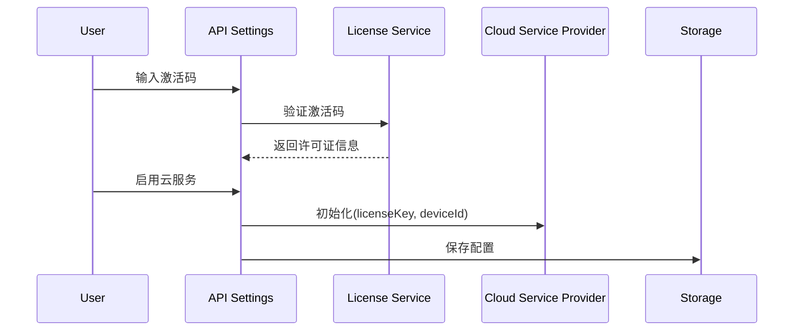
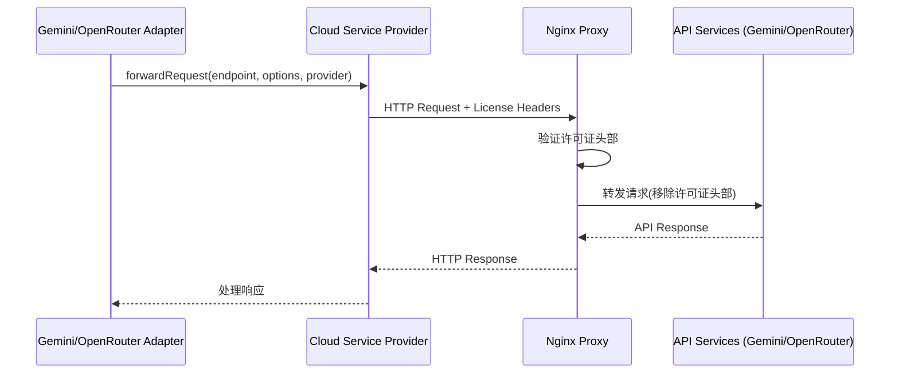
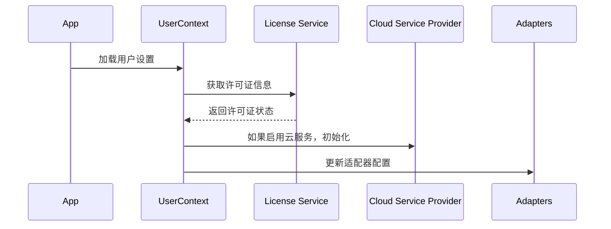

# Cradle 云服务适配器与消息转发 - 技术文档

## 1. 概述

本文档描述了 Cradle 项目中云服务适配器和消息转发功能的实现细节，包括文件结构、业务逻辑和数据流。该功能允许通过许可证验证的用户将 API 请求通过 Cradle 云服务转发到 OpenRouter 和 Gemini 端点，从而绕过地区限制并简化 API 密钥管理。

## 2. 文件结构

```
f:\my-app\
│
├── app\
│   └── pages\
│       └── api-settings.tsx           # API 设置界面，包含云服务选项
│
├── services\
│   ├── cloud-service-provider.ts      # 云服务提供者，处理消息转发
│   └── license-service.ts             # 许可证服务，验证用户许可证
│
├── NodeST\nodest\utils\
│   ├── gemini-adapter.ts              # Gemini AI 适配器
│   └── openrouter-adapter.ts          # OpenRouter API 适配器
│
├── shared\
│   └── types.ts                       # 类型定义
│
├── constants\
│   └── api-config.ts                  # API 配置，包含端点 URL
│
└── infra\                             # 基础设施代码
    ├── nginx\
    │   └── cradlecloud.conf           # Nginx 配置文件
    └── php\
        └── chat.php                   # PHP 转发脚本
```

## 3. 组件说明

### 3.1 前端组件

#### 3.1.1 API 设置界面 (api-settings.tsx)

API 设置页面允许用户配置 Gemini 和 OpenRouter 的 API 密钥，并在成功激活许可证后开启云服务功能。

主要功能：
- 激活码验证
- 云服务开关
- Gemini API 密钥配置
- OpenRouter API 配置
- 智谱嵌入设置

关键逻辑：
```typescript
// 仅当用户有有效许可证时启用云服务选项
{licenseInfo ? (
  <View style={styles.cloudServiceContainer}>
    <Text style={styles.cloudServiceLabel}>启用云服务</Text>
    <Switch
      value={useCloudService}
      onValueChange={setUseCloudService}
      disabled={!licenseInfo}
    />
  </View>
) : null}

// 保存设置时初始化云服务
if (useCloudService && licenseInfo) {
  CloudServiceProvider.initialize({
    enabled: true,
    licenseKey: licenseInfo.licenseKey,
    deviceId: licenseInfo.deviceId
  });
}
```

### 3.2 核心服务组件

#### 3.2.1 云服务提供者 (cloud-service-provider.ts)

负责处理 API 请求转发的核心服务。

功能：
- 初始化云服务（使用许可证信息）
- 启用/禁用云服务
- 请求转发到云端 API
- 错误处理与状态管理

关键方法：
```typescript
// 转发请求方法
async forwardRequest(
  endpoint: string, 
  requestOptions: RequestInit,
  provider: 'openrouter' | 'gemini'
): Promise<Response>
```

#### 3.2.2 许可证服务 (license-service.ts)

管理用户许可证的验证与存储。

功能：
- 验证许可证
- 获取许可证信息
- 清除许可证

### 3.3 适配器组件

#### 3.3.1 Gemini 适配器 (gemini-adapter.ts)

提供与 Gemini AI 接口交互的能力，并支持通过云服务转发请求。

主要功能：
- 文本生成
- 多模态内容生成
- 图像生成与编辑
- 内容分析

关键逻辑：
```typescript
// 在发送请求前检查是否使用云服务
if (CloudServiceProvider.isEnabled()) {
  response = await CloudServiceProvider.forwardRequest(
    url,
    {
      method: 'POST',
      headers: this.headers,
      body: JSON.stringify(data)
    },
    'gemini'
  );
} else {
  // 使用直接 API 调用
  response = await fetch(url, {
    method: 'POST',
    headers: this.headers,
    body: JSON.stringify(data)
  });
}
```

#### 3.3.2 OpenRouter 适配器 (openrouter-adapter.ts)

提供与 OpenRouter API 接口交互的能力，并支持通过云服务转发请求。

主要功能：
- 内容生成
- 模型选择
- 模型列表获取
- 工具调用

### 3.4 基础设施组件

#### 3.4.1 Nginx 配置 (cradlecloud.conf)

负责处理入站 API 请求并转发到目标服务。

关键功能：
- TLS 终结
- 请求验证
- 动态路由转发
- 安全控制
- 速率限制

关键配置：
```nginx
# 根据提供者和查询参数设置目标 URL
if ($http_x_provider = 'gemini') {
  set $target_url 'https://generativelanguage.googleapis.com$arg_endpoint';
}
if ($http_x_provider = 'openrouter') {
  set $target_url 'https://openrouter.ai/api/v1$arg_endpoint';
}

# 转发请求
proxy_pass $target_url;
```

#### 3.4.2 PHP 转发脚本 (chat.php)

作为后备方案，提供通过 PHP 处理 API 请求转发的能力。

功能：
- 许可证验证
- 请求转发
- 错误处理
- 请求/响应转换

## 4. 数据流

### 4.1 开启云服务流程



### 4.2 API 请求转发流程



### 4.3 配置加载流程



## 5. 业务逻辑

### 5.1 许可证验证

1. 用户输入激活码
2. 通过 `license-service.ts` 验证激活码
3. 验证成功后获取许可证信息（包括许可证密钥和设备 ID）
4. 许可证状态保存在用户设置中

### 5.2 云服务激活

1. 用户启用云服务开关
2. 应用调用 `CloudServiceProvider.initialize()` 传入许可证信息
3. CloudServiceProvider 存储凭证并设置 `enabled` 状态为 true
4. 配置保存到用户设置

### 5.3 请求转发

1. 适配器发送请求前检查 `CloudServiceProvider.isEnabled()`
2. 如果启用，调用 `CloudServiceProvider.forwardRequest()`
3. CloudServiceProvider 向云服务端点发送请求，附加许可证头信息
4. 云服务验证许可证并转发请求到相应 API 提供商
5. 响应通过相同路径返回给适配器

### 5.4 错误处理流程

1. 许可证验证失败：返回 403 错误，提示用户验证失败
2. 云服务不可用：自动回退到直接 API 调用模式
3. 目标 API 错误：将错误信息透传给客户端
4. 网络问题：提供适当的错误信息并允许重试

## 6. 配置参数

### 6.1 API 配置 (api-config.ts)

关键配置：

```typescript
// 云服务配置
CLOUD_API_URL: 'https://chat.cradleintro.top',
CLOUD_API_FALLBACKS: [
  'https://chat-api.cradleintro.top',
  'https://chat-backup.cradleintro.top'
],

// API URLs
API_URLS: {
  GEMINI: 'https://generativelanguage.googleapis.com/v1beta',
  OPENROUTER: 'https://openrouter.ai/api/v1',
  ZHIPU: 'https://open.bigmodel.cn/api/paas/v4'
}
```

### 6.2 类型定义 (types.ts)

关键类型：

```typescript
// 云服务配置
export interface CloudServiceConfig {
  enabled: boolean;
  licenseKey?: string;
  deviceId?: string;
}

// API 转发选项
export interface ApiForwardingOptions {
  useCloud: boolean;
  provider: 'gemini' | 'openrouter';
  endpoint: string;
  headers: Record<string, string>;
}
```

## 7. 安全考虑

### 7.1 许可证验证

- 使用安全通道传输许可证信息
- 将设备 ID 与许可证绑定以防止滥用
- 限制单个许可证可使用的设备数量

### 7.2 API 密钥保护

- 云服务不存储用户的原始 API 密钥
- 通过 HTTPS 传输所有请求
- 使用单向哈希验证许可证有效性

### 7.3 请求限制

- 实施速率限制以防止滥用
- 对超过额度的请求应用节流机制
- 监控异常使用模式

## 8. 扩展性考虑

### 8.1 添加新 API 提供商

要添加新的 API 提供商，需要：
1. 更新 `cloud-service-provider.ts` 中的 provider 类型
2. 在 Nginx 配置中添加新的目标 URL 映射
3. 创建相应的适配器类
4. 更新类型定义

### 8.2 高可用性

当前架构通过以下方式支持高可用：
1. 设置多个备用 API 端点
2. 在云服务不可用时自动回退到直接 API 调用
3. 实施重试逻辑以处理临时失败

## 9. 性能考虑

### 9.1 延迟

- 通过云服务转发将增加额外的网络跳转
- 采用长连接和连接池减少 TCP 握手开销
- 使用缓冲区优化大型响应处理

### 9.2 缓存策略

- 响应头设置适当的缓存控制指令
- 不缓存包含个人数据的响应
- 考虑为常见请求实施智能缓存

## 10. 总结

Cradle 云服务适配器与消息转发功能提供了一种灵活可靠的方式，让用户通过单一许可证访问多种 AI 服务，同时简化了 API 密钥管理并解决了地区限制问题。该系统的模块化设计确保了与现有代码的兼容性，并为未来扩展提供了基础。