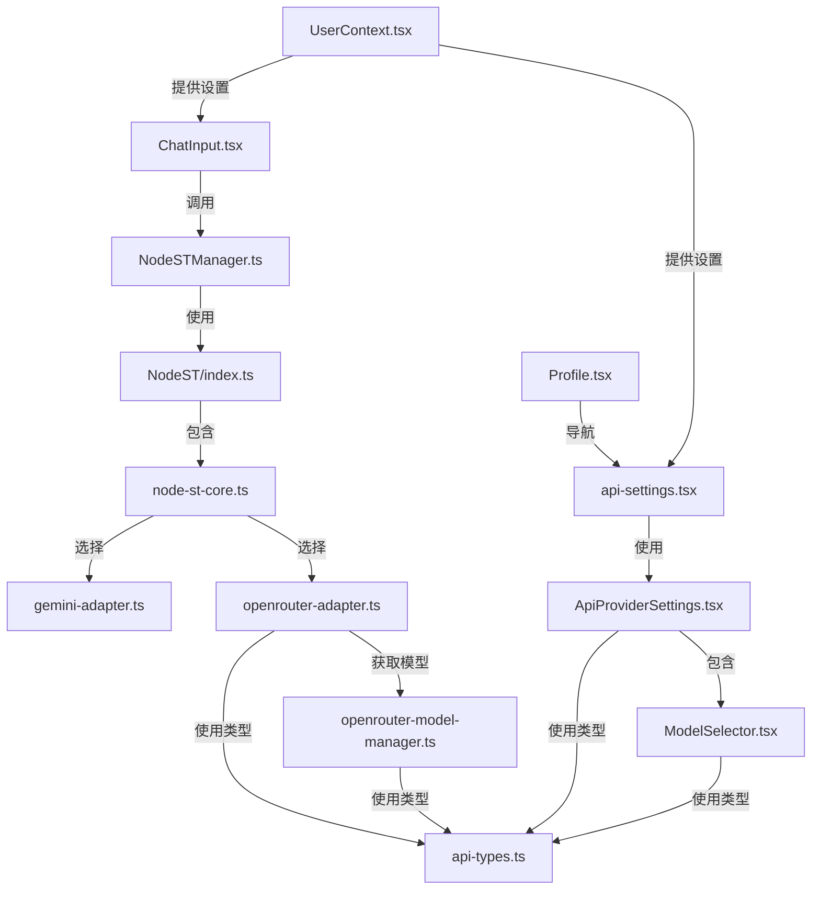

# 更新日志

### 2024-01-xx
- 修复了地理位置限制错误处理
- 添加了必要的请求头：HTTP-Referer 和 X-Title
- 改进了错误消息格式化和日志记录
- 统一了API响应格式处理

# OpenRouter API 集成文件结构

本文档介绍了 OpenRouter API 集成到应用的文件结构，帮助开发者了解代码组织和关键组件的位置。

## 1. 核心文件

### 适配器和 API 交互

| 文件路径 | 描述 |
|---------|------|
| `/NodeST/nodest/utils/openrouter-adapter.ts` | OpenRouter API 适配器，处理 API 请求和响应格式化 |
| `/NodeST/nodest/utils/openrouter-model-manager.ts` | 管理模型列表、缓存和过滤逻辑 |
| `/shared/types/api-types.ts` | 定义 OpenRouter 相关的类型和接口 |

### 核心功能

| 文件路径 | 描述 |
|---------|------|
| `/NodeST/nodest/index.ts` | NodeST 主类，处理 API 提供商路由 |
| `/NodeST/nodest/core/node-st-core.ts` | 核心逻辑，实现多 API 适配器支持 |
| `/utils/NodeSTManager.ts` | 包装 NodeST 类，供应用组件调用 |

## 2. UI 组件

### 设置界面

| 文件路径 | 描述 |
|---------|------|
| `/app/pages/api-settings.tsx` | API 设置页面 |
| `/components/settings/ApiProviderSettings.tsx` | API 提供商设置组件 |
| `/components/settings/ModelSelector.tsx` | 模型选择器组件 |

### 导航和入口

| 文件路径 | 描述 |
|---------|------|
| `/app/(tabs)/Profile.tsx` | 个人资料页面，包含 API 设置入口 |
| `/app/pages/global-settings.tsx` | 全局设置页面 |

## 3. 集成点

### 消息处理

| 文件路径 | 描述 |
|---------|------|
| `/components/ChatInput.tsx` | 聊天输入组件，调用 NodeSTManager 处理消息 |

### 用户设置

| 文件路径 | 描述 |
|---------|------|
| `/constants/UserContext.tsx` | 用户上下文，存储和提供 API 设置 |

## 4. 文档和参考

| 文件路径 | 描述 |
|---------|------|
| `/docs/openrouter-integration.md` | OpenRouter API 集成文档 |
| `/docs/openrouter-types.md` | OpenRouter 类型定义文档 |
| `/docs/openrouter-file-structure.md` | 文件结构文档（本文件）|

## 5. 文件间关系图



## 6. 目录结构

```
/f:/my-app/
│
├── app/
│   ├── (tabs)/
│   │   └── Profile.tsx                 # API设置入口
│   └── pages/
│       ├── api-settings.tsx            # API设置页面
│       └── global-settings.tsx         # 全局设置页面
│
├── components/
│   ├── ChatInput.tsx                   # 聊天输入组件
│   └── settings/
│       ├── ApiProviderSettings.tsx     # API提供商设置组件
│       └── ModelSelector.tsx           # 模型选择器组件
│
├── NodeST/
│   └── nodest/
│       ├── index.ts                    # NodeST主类
│       ├── core/
│       │   └── node-st-core.ts         # NodeST核心逻辑
│       └── utils/
│           ├── gemini-adapter.ts       # Gemini适配器
│           ├── openrouter-adapter.ts   # OpenRouter适配器
│           └── openrouter-model-manager.ts  # 模型管理器
│
├── constants/
│   └── UserContext.tsx                 # 用户上下文
│
├── shared/
│   └── types/
│       ├── api-types.ts                # API相关类型定义
│       └── index.ts                    # 通用类型定义
│
├── utils/
│   └── NodeSTManager.ts                # NodeST管理器
│
└── docs/
    ├── openrouter-integration.md       # 集成文档
    ├── openrouter-types.md             # 类型定义文档
    └── openrouter-file-structure.md    # 文件结构文档
```

## 7. 模块依赖关系

### 数据流

1. **用户设置流**:
   - 用户在 Profile.tsx 进入 api-settings.tsx
   - 通过 ApiProviderSettings.tsx 配置 API 设置
   - 使用 ModelSelector.tsx 选择 OpenRouter 模型
   - 设置存储到 UserContext.tsx

2. **消息处理流**:
   - ChatInput.tsx 获取用户输入
   - 从 UserContext.tsx 获取 API 设置
   - 调用 NodeSTManager.ts
   - NodeSTManager.ts 调用 NodeST/index.ts
   - NodeST 使用 node-st-core.ts 处理请求
   - node-st-core.ts 基于设置选择 openrouter-adapter.ts 或 gemini-adapter.ts
   - openrouter-adapter.ts 发送 API 请求并处理响应

3. **模型管理流**:
   - ApiProviderSettings.tsx 需要显示模型列表
   - 调用 openrouter-model-manager.ts 获取模型
   - openrouter-model-manager.ts 通过 openrouter-adapter.ts 获取数据
   - 结果缓存并返回给 ModelSelector.tsx 显示
```

```
# OpenRouter API 集成文档

## 1. 概述

本文档描述了在应用中如何使用 OpenRouter 作为 API 渠道。OpenRouter 提供了访问多种 AI 模型的能力，包括 GPT-3.5、GPT-4、Claude 等。

## 2. 架构设计

OpenRouter 集成采用适配器模式，在不修改现有代码的情况下添加新的 API 提供商支持。

### 2.1 主要组件

- **OpenRouterAdapter**: 处理与 OpenRouter API 的通信
- **OpenRouterModelManager**: 管理模型列表和缓存
- **ApiProviderSettings**: 用户界面设置组件
- **ModelSelector**: 用于选择模型的 UI 组件
- **NodeSTCore**: 核心逻辑，处理 API 提供商选择和请求

### 2.2 流程图（以通过Chatinput.tsx组件进行聊天为例）

```
用户输入 → ChatInput → NodeSTManager → NodeST → NodeSTCore → 
                                                          ├→ GeminiAdapter → Gemini API
                                                         └→ OpenRouterAdapter → OpenRouter API
```

## 3. 使用 OpenRouter API

### 3.1 开发者配置

需要在用户界面中添加 OpenRouter 相关选项:

1. API Provider 设置（在全局设置或 API 设置中）
2. OpenRouter API Key 配置
3. 模型选择器
4. 其他高级设置（排序策略、数据合规性等）

### 3.2 示例：在应用中调用 OpenRouter

#### 3.2.1 从 ChatInput 调用

```tsx
// 在 ChatInput 或其他组件中调用 NodeSTManager
const response = await NodeSTManager.processChatMessage({
  userMessage,                  // 用户消息
  conversationId: characterId,  // 角色/对话ID
  status: "同一角色继续对话",      // 状态
  apiKey: user?.settings?.chat.characterApiKey || '', // API Key
  apiSettings: {
    apiProvider: user?.settings?.chat.apiProvider || 'gemini',  // 提供商选择
    openrouter: user?.settings?.chat.openrouter               // OpenRouter 设置
  },
  character: selectedCharacter  // 角色数据
});
```

#### 3.2.2 从 NodeSTManager 到 NodeST

NodeSTManager 将请求传递给 NodeST，包括 API 设置：

```typescript
const response = await this.nodeST.processChatMessage({
  userMessage: params.userMessage,
  conversationId: params.conversationId,
  status: params.status,
  apiKey: params.apiKey,
  apiSettings: params.apiSettings,   // 传递 API 设置
  jsonString: params.character.jsonData
});
```

#### 3.2.3 NodeST 决定使用哪个适配器

NodeST 会基于 apiSettings 决定使用哪个适配器：

```typescript
// 获取 NodeSTCore 实例，并传递 API 设置
const core = this.getCoreInstance(params.apiKey, params.apiSettings);

// 在 NodeSTCore 中
private getActiveAdapter() {
  if (this.apiSettings.apiProvider === 'openrouter' && 
      this.apiSettings.openrouter?.enabled && 
      this.openRouterAdapter) {
    console.log('[NodeSTCore] Using OpenRouter adapter');
    return this.openRouterAdapter;
  }
  
  console.log('[NodeSTCore] Using Gemini adapter');
  return this.geminiAdapter;
}
```

## 4. OpenRouter 设置项说明

### 4.1 基础设置

| 设置项 | 类型 | 说明 |
|-------|-----|------|
| enabled | boolean | 是否启用 OpenRouter |
| apiKey | string | OpenRouter API Key |
| model | string | 默认使用的模型 ID |

### 4.2 高级设置

| 设置项 | 类型 | 说明 |
|-------|-----|------|
| autoRoute | boolean | 自动根据提示选择最佳模型 |
| useBackupModels | boolean | 在主模型不可用时使用备用模型 |
| backupModels | string[] | 备用模型列表 |
| sortingStrategy | string | 排序策略：'price', 'speed', 'latency' |
| dataCollection | boolean | 是否允许数据收集 |
| ignoredProviders | string[] | 忽略的提供商列表 |
| quantizationLevel | string | 量化级别 (可选) |

### 4.3 设置示例

```typescript
const openrouterSettings = {
  enabled: true,
  apiKey: "sk-or-xxx...",
  model: "openai/gpt-3.5-turbo",
  autoRoute: false,
  useBackupModels: true,
  backupModels: ["anthropic/claude-instant-v1"],
  sortingStrategy: "price",
  dataCollection: false,
  ignoredProviders: []
};
```

## 5. 处理 API 响应

OpenRouter 的响应与 Gemini 略有不同，但已通过适配器统一为相同的格式：

```typescript
// OpenRouterAdapter 中的响应处理
const result = await response.json();
            
if (result.choices?.[0]?.message?.content) {
  const responseText = result.choices[0].message.content;
  if (responseText) {
    this.conversationHistory.push({
      role: "assistant",
      parts: [{ text: responseText }]
    });
  }
  return responseText;
}
```

## 6. 错误处理

在使用 OpenRouter API 时可能遇到的常见错误：

1. **API Key 无效**: 确保在设置中提供有效的 OpenRouter API Key
2. **模型不可用**: 选择的模型可能暂时不可用，可以启用备用模型功能
3. **请求超时**: OpenRouter 请求可能需要更长的时间，已添加超时处理
4. **响应格式错误**: 确保适配器正确处理各种响应格式

## 7. 最佳实践

1. **测试连接**: 在正式使用前，使用"测试连接"按钮验证 API Key 是否有效
2. **缓存模型列表**: 避免频繁调用 List Models API
3. **选择经济模型**: 对于一般对话，使用 GPT-3.5 等经济型模型
4. **启用备用模型**: 提高可靠性，避免单点故障
5. **监控使用情况**: 注意 API 使用量和相关费用

## 8. 示例代码

### 8.1 完整调用示例

```typescript
import { NodeSTManager } from '@/utils/NodeSTManager';

// 调用 OpenRouter API 进行聊天
async function chatWithOpenRouter(message, character, user) {
  try {
    const response = await NodeSTManager.processChatMessage({
      userMessage: message,
      conversationId: character.id,
      status: "同一角色继续对话",
      apiKey: user?.settings?.chat.characterApiKey,
      apiSettings: {
        apiProvider: 'openrouter',
        openrouter: {
          enabled: true,
          apiKey: 'your-openrouter-api-key',
          model: 'anthropic/claude-2.1',
          autoRoute: false,
          useBackupModels: true,
          backupModels: ['openai/gpt-3.5-turbo'],
          sortingStrategy: 'price',
          dataCollection: false
        }
      },
      character: character
    });
    
    return response;
  } catch (error) {
    console.error('Error in OpenRouter chat:', error);
    throw error;
  }
}
```

## 9. 故障排除

### 9.1 常见问题

1. **无法连接到 OpenRouter**
   - 检查网络连接
   - 验证 API Key 是否正确
   - 确认 OpenRouter 服务是否正常运行

2. **模型列表为空**
   - 可能是 API Key 权限问题
   - 尝试清除缓存并重新获取
   - 查看控制台日志获取详细错误信息

3. **响应超时**
   - OpenRouter 可能繁忙
   - 尝试使用不同的模型
   - 检查请求大小，可能需要减少内容长度

### 9.2 调试技巧

1. 检查控制台日志中的 `[OpenRouterAdapter]` 和 `[OpenRouterModelManager]` 相关日志
2. 使用 "测试连接" 功能验证基本连接性
3. 尝试切换不同的模型和设置

## 10. 注意事项

1. **不同模型的能力差异**: 不同的模型有不同的能力和限制
2. **费用考虑**: OpenRouter 按照使用量收费，不同模型价格不同
3. **数据隐私**: 确保用户了解其数据如何被使用，特别是在启用数据收集设置时
4. **API 限制**: 某些模型可能有 API 调用频率限制

## 11. 未来扩展计划

1. 添加更多 API 提供商支持
2. 改进模型选择 UI 和用户体验
3. 实现使用统计和成本分析功能
4. 支持更多的 OpenRouter 高级功能
```

```
# OpenRouter 类型定义文档

## 基本类型

本文档提供了与 OpenRouter API 集成相关的主要类型定义，这些类型定义在 `/shared/types/api-types.ts` 文件中。

### OpenRouterSettings

用于存储和管理 OpenRouter 的配置设置。

```typescript
interface OpenRouterSettings {
    enabled: boolean;          // 是否启用 OpenRouter
    apiKey: string;            // OpenRouter API Key
    model: string;             // 当前选择的模型 ID
    autoRoute: boolean;        // 是否启用自动路由
    useBackupModels: boolean;  // 在主模型不可用时使用备用模型
    backupModels: string[];    // 备用模型列表
    sortingStrategy: 'price' | 'speed' | 'latency';  // 排序策略
    dataCollection: boolean;   // 是否允许数据收集
    ignoredProviders: string[];  // 忽略的提供商列表
    quantizationLevel?: string;  // 量化级别 (可选)
}
```

### OpenRouterModel

表示从 OpenRouter API 获取的模型信息。

```typescript
interface OpenRouterModel {
    id: string;               // 模型的唯一标识符
    name: string;             // 模型的显示名称
    description?: string;     // 模型描述 (可选)
    context_length?: number;  // 模型的上下文长度 (可选)
    pricing?: {               // 价格信息 (可选)
        prompt?: number;      // 每 1K tokens 的输入价格
        completion?: number;  // 每 1K tokens 的输出价格
    };
    provider?: {              // 提供商信息 (可选)
        id?: string;          // 提供商 ID
        name?: string;        // 提供商名称
    };
}
```

### ApiSettings

API 设置的整体结构，包含不同提供商的配置。

```typescript
interface ApiSettings {
    provider: 'gemini' | 'openrouter';  // 当前选择的 API 提供商
    gemini: {
        apiKey: string;                 // Gemini API Key
    };
    openrouter: OpenRouterSettings;     // OpenRouter 设置
}
```

## 适配器接口

### OpenRouterAdapter 方法

`OpenRouterAdapter` 类提供与 OpenRouter API 交互的核心功能。

```typescript
class OpenRouterAdapter {
    // 构造函数
    constructor(apiKey: string, model: string = "openai/gpt-3.5-turbo")

    // 生成内容 - 与 Gemini 适配器接口一致
    async generateContent(contents: ChatMessage[]): Promise<string>

    // 获取可用模型列表
    async listModels(): Promise<OpenRouterModel[]>

    // 获取聊天历史
    getChatHistory(): Array<{ role: string; text: string }>
}
```

### OpenRouterModelManager 方法

`OpenRouterModelManager` 类管理模型缓存和获取。

```typescript
class OpenRouterModelManager {
    // 获取可用模型列表，支持缓存
    static async getModels(apiKey: string, forceRefresh = false): Promise<OpenRouterModel[]>

    // 清除缓存
    static async clearCache(): Promise<void>
}
```

## 请求和响应类型

### OpenRouter API 请求结构

```typescript
// 请求结构
{
  model: string,           // 模型 ID
  messages: Array<{        // 消息数组
    role: "user" | "assistant" | "system",  // 消息角色
    content: string        // 消息内容
  }>,
  temperature?: number,    // 温度（控制随机性）
  max_tokens?: number,     // 最大生成的标记数
  // 其他可选参数...
}
```

### OpenRouter API 响应结构

```typescript
// 响应结构
{
  "id": "gen-xxx",
  "choices": [
    {
      "message": {
        "role": "assistant",
        "content": "response text..."
      }
    }
  ]
}
```

## 集成示例

### 向 NodeSTCore 添加 API 提供商设置

```typescript
// 初始化适配器
private initAdapters(apiKey: string, apiSettings?: Pick<GlobalSettings['chat'], 'apiProvider' | 'openrouter'>) {
    // 始终初始化 Gemini 作为后备选项
    this.geminiAdapter = new GeminiAdapter(apiKey);
    
    // 如果启用了 OpenRouter 且提供了 API 密钥，初始化 OpenRouter
    if (apiSettings?.apiProvider === 'openrouter' && 
        apiSettings.openrouter?.enabled && 
        apiSettings.openrouter?.apiKey) {
        this.openRouterAdapter = new OpenRouterAdapter(
            apiSettings.openrouter.apiKey,
            apiSettings.openrouter.model || 'openai/gpt-3.5-turbo'
        );
    }
    
    // 存储设置以供后续使用
    if (apiSettings) {
        this.apiSettings = apiSettings;
    }
}

// 根据设置获取活跃适配器
private getActiveAdapter() {
    if (this.apiSettings.apiProvider === 'openrouter' && 
        this.apiSettings.openrouter?.enabled && 
        this.openRouterAdapter) {
        return this.openRouterAdapter;
    }
    return this.geminiAdapter;
}
```

### 在 ChatInput 中传递 API 设置

```typescript
const response = await NodeSTManager.processChatMessage({
  userMessage,
  conversationId: selectedCharacter.id,
  status: "同一角色继续对话",
  apiKey: user?.settings?.chat.characterApiKey || '',
  apiSettings: {
    apiProvider: user?.settings?.chat.apiProvider || 'gemini',
    openrouter: user?.settings?.chat.openrouter
  },
  character: selectedCharacter
});
```
