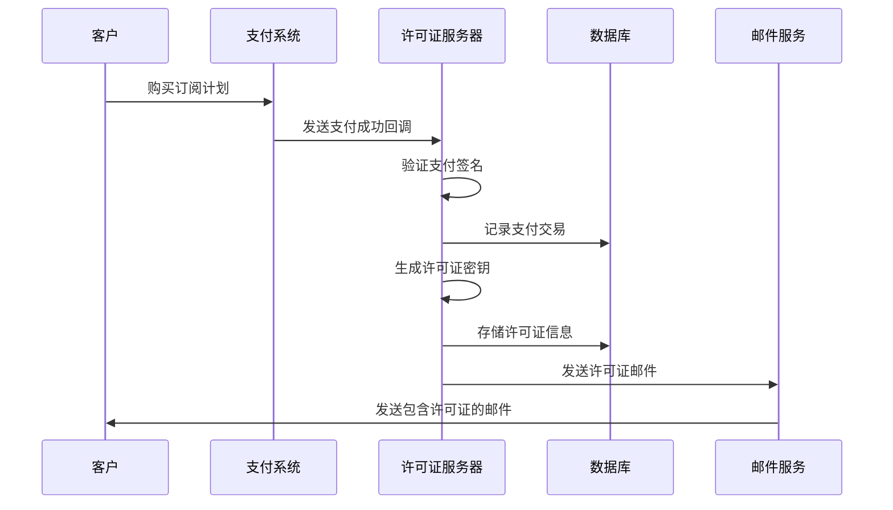
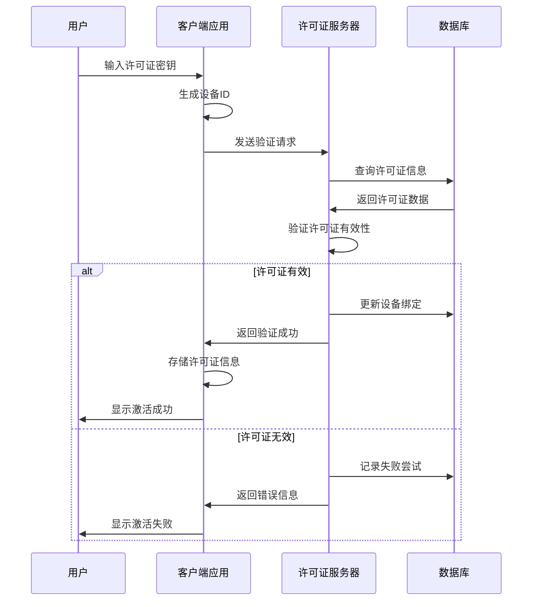
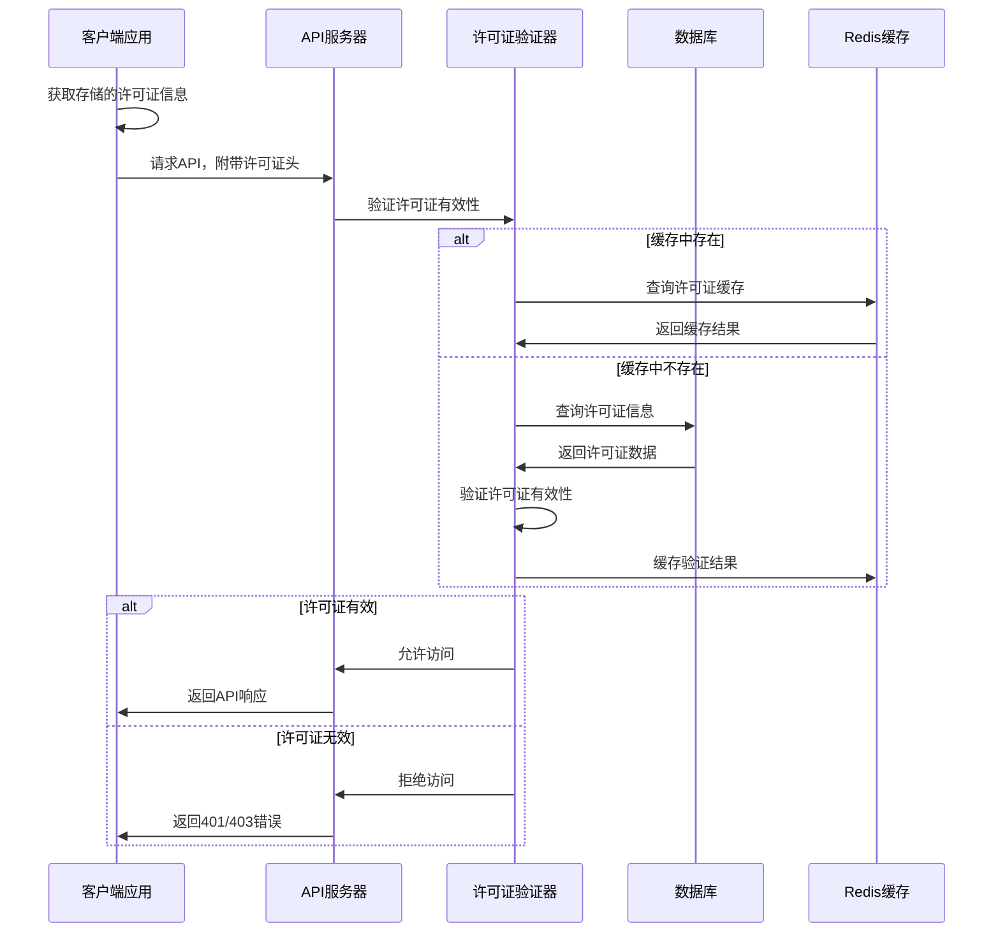

# 许可证管理系统文档

本文档详细介绍了许可证管理系统的架构、实现、业务流程以及如何与其他应用集成。

## 1. 文件结构

许可证管理系统包含服务器端和客户端两部分组件，文件结构如下：

### 服务器端组件

```
f:\my-app\text2image_service\
├── database/
│   └── schema.py            # 数据库模式定义，创建许可证相关表
├── config.py                # 配置文件，包含许可证系统的各种参数
├── license_generator.py     # 许可证生成器，负责创建和撤销许可证
├── license_validator.py     # 许可证验证器，验证许可证有效性，提供API访问控制
├── license_api.py           # 许可证API接口，暴露许可证管理的REST接口
└── test_payment_callback.py # 支付回调模拟测试脚本
```

### 客户端组件

```
f:\my-app\services\
├── license-service.ts       # 客户端许可证服务，管理许可证状态
└── license-request-helper.ts # 许可证API请求助手，处理与服务器通信

f:\my-app\app\pages\
└── api-settings.tsx         # API设置页面，包含许可证激活UI
```

## 2. 许可证系统架构

### 2.1 数据库架构

许可证系统使用SQLite数据库，包含三个主要表：

1. **activation_codes**: 存储许可证信息
   - id: 主键
   - code: 许可证码（唯一）
   - salt: 随机盐值
   - hash: 存储的哈希值
   - devices: 已绑定设备列表
   - plan_id: 订阅计划ID
   - created_at: 创建时间戳
   - expires_at: 过期时间戳
   - is_active: 激活状态
   - failed_attempts: 失败尝试次数
   - last_verified_at: 最后验证时间

2. **license_audit_log**: 记录许可证操作日志
   - id: 主键
   - code_id: 关联许可证ID
   - action: 操作类型
   - timestamp: 操作时间戳
   - client_ip: 客户端IP
   - device_id: 设备ID
   - status: 操作状态

3. **payment_transactions**: 记录支付交易信息
   - id: 主键
   - transaction_id: 支付平台交易ID
   - amount: 交易金额
   - currency: 交易货币
   - status: 交易状态
   - customer_email: 客户邮箱
   - code_id: 关联许可证ID
   - timestamp: 交易时间戳

### 2.2 安全特性

1. **强密码学安全**:
   - 使用Argon2id算法派生密钥(时间因子=3，内存=65536 KiB，并行度=4)
   - 每个许可证使用唯一的32字节随机盐值
   - 使用主密钥签名，主密钥通过环境变量配置

2. **设备绑定**:
   - 每个许可证最多绑定3台设备
   - 设备ID基于硬件信息生成，确保唯一性

3. **速率限制**:
   - 验证API限制每IP每分钟最多5次请求
   - 连续验证失败后实施冷却期

4. **审计日志**:
   - 所有操作记录详细日志，便于追踪和审计
   - 包含时间戳、IP地址和操作结果

## 3. 业务流程与数据流

### 3.1 获取和激活许可证的流程

1. **许可证获取流程**:



2. **许可证激活流程**:



3. **API访问授权流程**:



### 3.2 数据传输格式

#### 许可证验证请求

```json
{
  "license_key": "XXXX-XXXX-XXXX-XXXX",
  "device_id": "device123abc"
}
```

#### 许可证验证响应（成功）

```json
{
  "success": true,
  "message": "许可证有效",
  "device_id": "device123abc",
  "license_info": {
    "id": 1,
    "code": "XXXX-XXXX-XXXX-XXXX",
    "plan_id": "premium",
    "created_date": "2023-05-01 10:00:00",
    "expiry_date": "2024-05-01 10:00:00",
    "is_active": true,
    "device_count": 1,
    "is_expired": false
  }
}
```

#### 许可证验证响应（失败）

```json
{
  "success": false,
  "error": "无效或已过期的许可证"
}
```

## 4. 测试脚本使用方法

### 4.1 支付回调测试脚本

`test_payment_callback.py` 脚本用于模拟支付系统的回调，生成新的许可证。

#### 使用方法

```bash
# 基本用法
python test_payment_callback.py --email 943113638@qq.com

# 指定金额和计划
python test_payment_callback.py --email customer@example.com --amount 49.99 --plan premium_yearly

# 指定API端点（用于测试不同环境）
python test_payment_callback.py --email customer@example.com --url http://localhost:5000/v1/license/payment_callback

# 使用自定义密钥签名
python test_payment_callback.py --email customer@example.com --secret your-custom-secret-key
```

#### 参数说明

- `--email`: （必填）客户邮箱，用于发送许可证
- `--url`: （可选）回调API地址，默认为 http://localhost:5000/api/v1/license/payment_callback
- `--secret`: （可选）签名密钥，默认使用配置中的PAYMENT_WEBHOOK_SECRET
- `--amount`: （可选）支付金额，默认为29.99
- `--currency`: （可选）货币类型，默认为USD
- `--plan`: （可选）订阅计划ID，默认为premium_monthly

### 4.2 本地测试环境配置

#### 环境变量配置

创建一个 `.env` 文件，包含以下配置：

```
# 数据库配置
LICENSE_DB_PATH=./database/licenses.db
LICENSE_MASTER_KEY=your-secure-master-key-for-testing

# Redis配置（可选，用于缓存）
REDIS_HOST=localhost
REDIS_PORT=6379
REDIS_DB=0

# 邮件配置
SMTP_SERVER=smtp.gmail.com
SMTP_PORT=587
SMTP_USERNAME=
SMTP_PASSWORD=
SMTP_SENDER=noreply@example.com

# 安全配置
PAYMENT_WEBHOOK_SECRET=your-webhook-secret-for-testing
ADMIN_API_TOKEN=admin-api-token-for-testing

# 速率限制配置
LICENSE_RATE_LIMIT_WINDOW=60
LICENSE_RATE_LIMIT_MAX_REQUESTS=10
```

#### 网络配置

1. 确保Flask应用运行在localhost:5000上
2. 如果使用Redis缓存，确保Redis服务器在localhost:6379上运行
3. 确保SMTP服务器能够正常连接（或使用测试SMTP服务如Mailtrap）

#### 数据库初始化

首次运行前需要初始化数据库：

```python
from database.schema import initialize_database
initialize_database('./database/licenses.db')
```

## 5. 与其他Flask应用集成

### 5.1 集成步骤

1. **添加依赖**：确保您的Flask应用安装了所需的依赖：

```bash
pip install argon2-cffi redis flask
```

2. **复制核心文件**：将以下文件复制到您的应用中：
   - `database/schema.py`
   - `license_validator.py`
   - `license_generator.py`（如果需要生成许可证）

3. **添加配置**：在应用的配置文件中添加许可证系统配置：

```python
# License management configuration
LICENSE_DB_PATH = os.environ.get('LICENSE_DB_PATH', os.path.join(os.path.dirname(__file__), 'database', 'licenses.db'))
LICENSE_MASTER_KEY = os.environ.get('LICENSE_MASTER_KEY', 'your-secure-master-key')
LICENSE_RATE_LIMIT_WINDOW = int(os.environ.get('LICENSE_RATE_LIMIT_WINDOW', 60))
LICENSE_RATE_LIMIT_MAX_REQUESTS = int(os.environ.get('LICENSE_RATE_LIMIT_MAX_REQUESTS', 5))
LICENSE_CACHE_TTL = int(os.environ.get('LICENSE_CACHE_TTL', 300))
```

4. **初始化数据库**：确保数据库已初始化：

```python
from database.schema import initialize_database
initialize_database(LICENSE_DB_PATH)
```

5. **导入验证装饰器**：在需要保护的API中导入并使用验证装饰器：

```python
from license_validator import require_license

@app.route('/protected-api', methods=['GET'])
@require_license
def protected_api():
    # 只有有效许可证才能访问此API
    return jsonify({"message": "Access granted"})
```

### 5.2 集成示例

以下是一个简单的示例，展示如何在Flask应用中集成许可证验证：

```python
from flask import Flask, jsonify, request
from license_validator import require_license, license_validator

app = Flask(__name__)

# 配置项
app.config['LICENSE_DB_PATH'] = './database/licenses.db'
app.config['LICENSE_MASTER_KEY'] = 'your-secure-master-key'

# 公开API - 无需许可证
@app.route('/public-api', methods=['GET'])
def public_api():
    return jsonify({"message": "This is a public API"})

# 受保护API - 需要许可证
@app.route('/protected-api', methods=['GET'])
@require_license
def protected_api():
    return jsonify({"message": "You have access to protected API"})

# 管理API - 检查许可证状态
@app.route('/check-license/<license_key>', methods=['GET'])
def check_license(license_key):
    license_info = license_validator.get_license_info(license_key)
    if license_info:
        return jsonify({"valid": True, "license_info": license_info})
    else:
        return jsonify({"valid": False}), 404

if __name__ == '__main__':
    app.run(debug=True)
```

### 5.3 API客户端集成

客户端应用需要在API请求中包含许可证头：

```javascript
// 获取许可证信息
const licenseKey = localStorage.getItem('license_key');
const deviceId = localStorage.getItem('device_id');

// 添加到API请求
fetch('https://api.example.com/protected-api', {
  method: 'GET',
  headers: {
    'Content-Type': 'application/json',
    'X-License-Key': licenseKey,
    'X-Device-ID': deviceId
  }
})
.then(response => {
  if (response.status === 403) {
    // 许可证无效
    console.error('License is invalid or expired');
    // 提示用户重新激活
  } else {
    return response.json();
  }
})
.then(data => {
  // 处理API响应
  console.log(data);
});
```

## 6. 安全性与性能考虑

### 6.1 安全最佳实践

1. **安全存储主密钥**：
   - 使用环境变量或安全的密钥管理服务
   - 定期轮换主密钥

2. **防止暴力破解**：
   - 实施速率限制
   - 记录并警告异常行为
   - 连续失败后临时锁定账户

3. **安全通信**：
   - 所有API通信使用HTTPS
   - 验证支付回调的签名

4. **数据库安全**：
   - 限制数据库访问权限
   - 定期备份
   - 敏感数据加密存储

### 6.2 性能优化

1. **缓存验证结果**：
   - 使用Redis缓存有效的许可证验证结果
   - 设置适当的TTL（生存时间）

2. **数据库索引**：
   - 为频繁查询的字段创建索引
   - 定期优化数据库

3. **异步处理**：
   - 使用后台任务处理邮件发送
   - 异步记录审计日志

## 7. 故障排除

### 常见问题与解决方案

1. **许可证验证失败**：
   - 检查许可证码是否正确
   - 确认设备未超过绑定限制
   - 验证许可证未过期
   - 检查数据库中的许可证状态

2. **API 请求被拒绝**：
   - 确认请求头中包含正确的许可证信息
   - 检查是否超出速率限制
   - 验证许可证是否处于活跃状态

3. **支付回调失败**：
   - 验证签名是否正确
   - 确认支付数据格式完整
   - 检查交易ID是否重复

4. **数据库错误**：
   - 检查数据库文件权限
   - 确认数据库路径配置正确
   - 验证表结构是否完整

## 8. 总结

许可证管理系统提供了一套完整的解决方案，用于控制对API的访问权限。通过采用现代密码学技术、设备绑定和审计日志等安全措施，确保只有授权用户才能访问受保护的服务。

系统的模块化设计使其易于与各种Flask应用集成，同时提供了灵活的配置选项，以适应不同的部署环境和安全要求。

通过遵循本文档中的集成步骤和安全最佳实践，您可以有效地保护您的API资源，并为用户提供便捷的许可证管理体验。