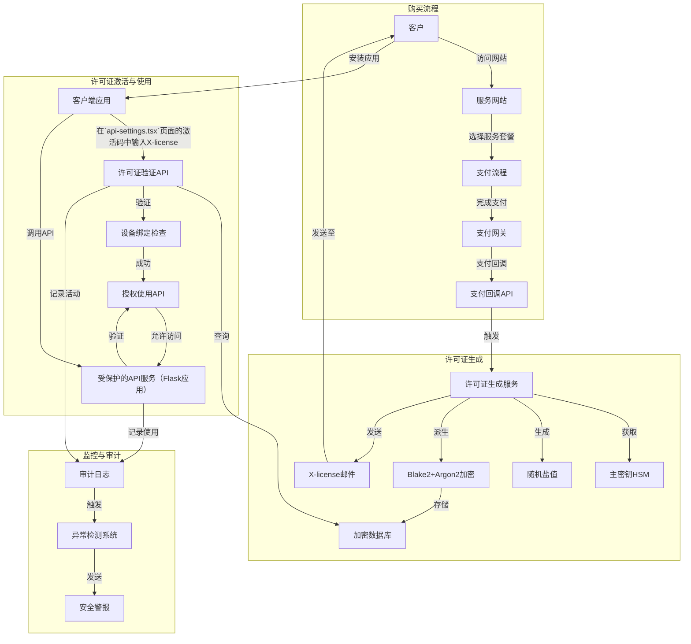
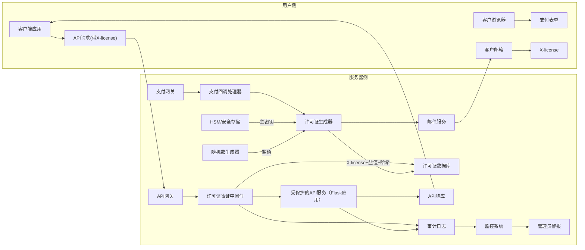

# 许可证管理系统设计规范文档

## 1. 系统概述

本系统旨在为应用程序提供安全、可靠的许可证管理解决方案，包括许可证生成、验证、撤销和审计功能。通过结合现代密码学技术和安全实践，确保只有合法用户能够访问受保护的API服务。

## 2. 业务流程与安全架构

### 2.1 许可证生命周期

#### 2.1.1 许可证生成阶段
- 客户在网站购买服务后，系统生成唯一的X-license
- X-license通过加密的TLS通道发送给客户(例如加密邮件)
- 系统使用HSM保护的主密钥(至少256位)和加密状态下存储的至少32字节的随机盐值，通过Blake2+Argon2(时间因子≥3，内存因子≥65536 KiB，并行度≥4)派生真实密钥
- 所有密钥材料必须在内存中最小化保留时间，使用后立即清除

#### 2.1.2 许可证验证阶段
- 用户在api-setting.tsx 输入激活码，进行X-license激活，通过TLS加密通道将X-license和设备唯一标识符发送给服务器
- 验证请求必须包含防重放令牌(nonce或时间戳+签名)
- 系统实施速率限制(每IP每分钟≤5次尝试)和验证失败锁定机制(连续5次失败后锁定10分钟)
- 每个X-license绑定到特定设备(最多允许3台设备)，防止大规模共享

#### 2.1.3 许可证撤销与更新
- 实现许可证撤销机制，允许在安全受损时使特定许可证失效
- 主密钥定期轮换(至少每季度一次)，同时确保已颁发许可证的持续可用性
- 维护许可证审计日志，但排除敏感信息(如原始密钥材料)

### 2.2 系统组件设计

#### 2.2.1 真实密钥生成工具
- 使用安全的随机数生成器(secrets模块)创建盐值和许可证标识符
- 数据库加密存储(使用SQLCipher或等效技术)，访问需要强身份验证
- 数据库备份采用独立加密，采用3-2-1备份策略(3份备份，2种媒介，1份异地)
- 管理员访问采用多因素认证和最小权限原则

#### 2.2.2 Flask应用集成

现有的Flask应用应该：

- API端点采用OAuth 2.0或JWT进行身份验证
- 所有API请求设置适当的CORS策略和CSP头部
- 所有用户输入必须进行严格验证和清洗(防XSS、CSRF、注入等)
- 支付回调使用消息认证码(HMAC)或数字签名验证请求合法性
- 使用幂等设计处理支付回调，避免重复处理(使用唯一交易ID)

#### 2.2.3 安全监控与审计
- 实现全面日志系统，记录所有关键操作(生成、验证、撤销)
- 日志中禁止包含完整的密钥材料、密码或个人识别信息
- 设置异常检测机制，监控可疑的访问模式或许可证使用行为
- 定期进行安全审计和渗透测试(至少每季度一次)

#### 2.2.4 错误处理与故障恢复
- 实现优雅的错误处理机制，避免暴露敏感系统信息
- 设计故障恢复流程，确保主密钥或数据库损坏时系统可恢复
- 错误消息对用户友好但对攻击者不提供有用信息

## 3. 技术实现规范

### 3.1 数据库设计

```sql
CREATE TABLE activation_codes (
    id INTEGER PRIMARY KEY AUTOINCREMENT,
    code TEXT UNIQUE NOT NULL,  -- 许可证编码
    salt TEXT NOT NULL,         -- 随机盐值
    hash TEXT NOT NULL,         -- 存储的哈希值
    devices TEXT,               -- 已绑定设备列表，逗号分隔
    plan_id TEXT,               -- 关联的订阅计划ID
    created_at INTEGER NOT NULL,-- 创建时间戳
    expires_at INTEGER,         -- 过期时间戳
    is_active BOOLEAN DEFAULT 1,-- 激活状态
    failed_attempts INTEGER DEFAULT 0, -- 失败尝试次数
    last_verified_at INTEGER    -- 最后验证时间
);

CREATE TABLE license_audit_log (
    id INTEGER PRIMARY KEY AUTOINCREMENT,
    code_id INTEGER,            -- 关联的许可证ID
    action TEXT NOT NULL,       -- 操作类型：生成/验证/撤销等
    timestamp INTEGER NOT NULL, -- 操作时间戳
    client_ip TEXT,             -- 客户端IP
    device_id TEXT,             -- 设备ID
    status TEXT,                -- 操作状态：成功/失败
    FOREIGN KEY (code_id) REFERENCES activation_codes (id)
);

CREATE TABLE payment_transactions (
    id INTEGER PRIMARY KEY AUTOINCREMENT,
    transaction_id TEXT UNIQUE NOT NULL, -- 支付平台交易ID
    amount REAL NOT NULL,       -- 交易金额
    currency TEXT NOT NULL,     -- 交易货币
    status TEXT NOT NULL,       -- 交易状态
    customer_email TEXT,        -- 客户邮箱
    code_id INTEGER,            -- 关联的许可证ID
    timestamp INTEGER NOT NULL, -- 交易时间戳
    FOREIGN KEY (code_id) REFERENCES activation_codes (id)
);
```

### 3.2 许可证验证模块

```python
import secrets
import time
import sqlite3
import hashlib
import argon2
from functools import wraps
from flask import request, jsonify, g
import redis

# 配置Redis缓存(若可用)
try:
    redis_client = redis.Redis(host='localhost', port=6379, db=0, socket_timeout=1)
    REDIS_AVAILABLE = True
except:
    REDIS_AVAILABLE = False

# 安全配置
RATE_LIMIT_WINDOW = 60  # 时间窗口(秒)
RATE_LIMIT_MAX_REQUESTS = 5  # 最大请求次数
LICENSE_CACHE_TTL = 300  # 许可证缓存过期时间(秒)

class LicenseValidator:
    def __init__(self, db_path, rate_limit=True):
        self.db_path = db_path
        self.rate_limit = rate_limit
        self.ph = argon2.PasswordHasher(
            time_cost=3,      # 增加时间成本提高安全性
            memory_cost=65536,  # 内存成本(KB)
            parallelism=4,    # 并行度
            hash_len=32,      # 哈希长度
            salt_len=16       # 盐值长度
        )
    
    def get_db_connection(self):
        """安全地获取数据库连接"""
        conn = sqlite3.connect(self.db_path)
        conn.row_factory = sqlite3.Row
        return conn
        
    def verify_license(self, license_key, device_id):
        """验证许可证是否有效"""
        # 首先尝试从缓存中获取
        cache_key = f"license:{license_key}:{device_id}"
        
        if REDIS_AVAILABLE:
            cached_result = redis_client.get(cache_key)
            if cached_result:
                return cached_result == b"valid"
        
        # 缓存未命中，检查数据库
        try:
            conn = self.get_db_connection()
            cursor = conn.cursor()
            
            # 参数化查询防止SQL注入
            cursor.execute(
                """
                SELECT code, salt, hash, devices, is_active, expires_at 
                FROM activation_codes 
                WHERE code = ? AND is_active = 1
                """, 
                (license_key,)
            )
            result = cursor.fetchone()
            
            if not result:
                self._log_failed_attempt(license_key, device_id)
                return False
                
            # 检查是否过期
            if result['expires_at'] and result['expires_at'] < time.time():
                self._log_failed_attempt(license_key, device_id, reason="expired")
                return False
                
            # 检查设备绑定
            devices = result['devices'].split(',') if result['devices'] else []
            
            if device_id not in devices:
                # 如果尚未绑定任何设备或设备数量未达到上限，则添加此设备
                if len(devices) < 3:  # 最多3台设备
                    devices.append(device_id)
                    cursor.execute(
                        "UPDATE activation_codes SET devices = ? WHERE code = ?",
                        (','.join(devices), license_key)
                    )
                    conn.commit()
                else:
                    # 设备数量已达上限
                    self._log_failed_attempt(license_key, device_id, reason="device_limit")
                    return False
            
            # 成功验证，更新最后验证时间
            cursor.execute(
                "UPDATE activation_codes SET last_verified_at = ?, failed_attempts = 0 WHERE code = ?",
                (int(time.time()), license_key)
            )
            conn.commit()
            
            # 记录审计日志
            self._log_successful_verification(cursor.lastrowid, device_id)
            
            # 结果缓存
            if REDIS_AVAILABLE:
                redis_client.setex(cache_key, LICENSE_CACHE_TTL, "valid")
                
            return True
            
        except Exception as e:
            # 记录异常但不暴露详细信息
            print(f"License verification error: {str(e)}")
            return False
            
        finally:
            if 'conn' in locals():
                conn.close()
    
    def _log_failed_attempt(self, license_key, device_id, reason="invalid"):
        """记录失败的验证尝试"""
        try:
            conn = self.get_db_connection()
            cursor = conn.cursor()
            
            # 更新失败计数
            cursor.execute(
                """
                UPDATE activation_codes 
                SET failed_attempts = failed_attempts + 1 
                WHERE code = ?
                """,
                (license_key,)
            )
            
            # 获取许可证ID
            cursor.execute("SELECT id FROM activation_codes WHERE code = ?", (license_key,))
            result = cursor.fetchone()
            code_id = result['id'] if result else None
            
            # 记录审计日志
            cursor.execute(
                """
                INSERT INTO license_audit_log 
                (code_id, action, timestamp, client_ip, device_id, status) 
                VALUES (?, ?, ?, ?, ?, ?)
                """,
                (
                    code_id,
                    "verify",
                    int(time.time()),
                    request.remote_addr,
                    device_id,
                    f"failed:{reason}"
                )
            )
            
            conn.commit()
        except Exception as e:
            print(f"Error logging failed attempt: {str(e)}")
        finally:
            if 'conn' in locals():
                conn.close()
                
    def _log_successful_verification(self, code_id, device_id):
        """记录成功的验证"""
        try:
            conn = self.get_db_connection()
            cursor = conn.cursor()
            
            cursor.execute(
                """
                INSERT INTO license_audit_log 
                (code_id, action, timestamp, client_ip, device_id, status) 
                VALUES (?, ?, ?, ?, ?, ?)
                """,
                (
                    code_id,
                    "verify",
                    int(time.time()),
                    request.remote_addr,
                    device_id,
                    "success"
                )
            )
            
            conn.commit()
        except Exception as e:
            print(f"Error logging successful verification: {str(e)}")
        finally:
            if 'conn' in locals():
                conn.close()
    
    def check_rate_limit(self, client_ip):
        """检查请求速率限制"""
        if not self.rate_limit or not REDIS_AVAILABLE:
            return True
            
        rate_key = f"ratelimit:{client_ip}"
        current = redis_client.get(rate_key)
        
        if current and int(current) >= RATE_LIMIT_MAX_REQUESTS:
            return False
            
        pipe = redis_client.pipeline()
        pipe.incr(rate_key)
        pipe.expire(rate_key, RATE_LIMIT_WINDOW)
        pipe.execute()
        
        return True

# 创建全局验证器实例
license_validator = LicenseValidator('path/to/your/encrypted.db')

# Flask装饰器中间件
def require_license(f):
    @wraps(f)
    def decorated_function(*args, **kwargs):
        # 获取客户端IP以进行速率限制
        client_ip = request.remote_addr
        
        # 检查速率限制
        if not license_validator.check_rate_limit(client_ip):
            return jsonify({
                'success': False,
                'error': 'Rate limit exceeded. Please try again later.'
            }), 429
        
        # 从请求中获取许可证和设备ID
        license_key = request.headers.get('X-License-Key')
        device_id = request.headers.get('X-Device-ID')
        
        if not license_key or not device_id:
            return jsonify({
                'success': False,
                'error': 'Missing license key or device ID'
            }), 401
        
        # 验证许可证
        if not license_validator.verify_license(license_key, device_id):
            return jsonify({
                'success': False, 
                'error': 'Invalid or expired license'
            }), 403
        
        # 许可证有效，继续处理请求
        return f(*args, **kwargs)
    
    return decorated_function
```

### 3.3 许可证生成工具

```python
import secrets
import time
import sqlite3
import hashlib
import argon2
import os
from flask import Flask, request, jsonify
from functools import wraps

app = Flask(__name__)

# 安全配置
LICENSE_LENGTH = 24  # 许可证长度
SALT_LENGTH = 16    # 盐值长度
KEY_DERIVATION_ITERATIONS = 100000  # 密钥派生迭代次数

class LicenseGenerator:
    def __init__(self, db_path, master_key_env_var='LICENSE_MASTER_KEY'):
        self.db_path = db_path
        # 从环境变量获取主密钥，避免硬编码
        self.master_key = os.environ.get(master_key_env_var)
        if not self.master_key:
            raise ValueError(f"Master key environment variable {master_key_env_var} not set")
            
        self.ph = argon2.PasswordHasher(
            time_cost=3,
            memory_cost=65536,
            parallelism=4,
            hash_len=32,
            salt_len=16
        )
    
    def get_db_connection(self):
        """安全地获取数据库连接"""
        conn = sqlite3.connect(self.db_path)
        conn.row_factory = sqlite3.Row
        return conn
        
    def generate_license(self, plan_id, validity_days=365):
        """生成新的许可证"""
        # 生成随机许可证编码
        license_key = secrets.token_urlsafe(LICENSE_LENGTH)
        
        # 生成随机盐值
        salt = secrets.token_hex(SALT_LENGTH)
        
        # 派生密钥
        key_material = f"{license_key}:{self.master_key}"
        hash_value = self.ph.hash(key_material)
        
        # 计算过期时间
        expires_at = int(time.time()) + (validity_days * 86400)
        
        try:
            conn = self.get_db_connection()
            cursor = conn.cursor()
            
            # 插入新许可证
            cursor.execute(
                """
                INSERT INTO activation_codes 
                (code, salt, hash, plan_id, created_at, expires_at, is_active) 
                VALUES (?, ?, ?, ?, ?, ?, 1)
                """,
                (license_key, salt, hash_value, plan_id, int(time.time()), expires_at)
            )
            
            license_id = cursor.lastrowid
            
            # 记录审计日志
            cursor.execute(
                """
                INSERT INTO license_audit_log 
                (code_id, action, timestamp, client_ip, status) 
                VALUES (?, ?, ?, ?, ?)
                """,
                (
                    license_id,
                    "generate",
                    int(time.time()),
                    request.remote_addr if request else "internal",
                    "success"
                )
            )
            
            conn.commit()
            
            return {
                "license_key": license_key,
                "plan_id": plan_id,
                "expires_at": expires_at
            }
            
        except Exception as e:
            if 'conn' in locals():
                conn.rollback()
            print(f"License generation error: {str(e)}")
            raise
            
        finally:
            if 'conn' in locals():
                conn.close()
    
    def revoke_license(self, license_key):
        """撤销许可证"""
        try:
            conn = self.get_db_connection()
            cursor = conn.cursor()
            
            cursor.execute(
                "UPDATE activation_codes SET is_active = 0 WHERE code = ?",
                (license_key,)
            )
            
            if cursor.rowcount == 0:
                return False
                
            # 获取许可证ID
            cursor.execute("SELECT id FROM activation_codes WHERE code = ?", (license_key,))
            result = cursor.fetchone()
            
            # 记录审计日志
            cursor.execute(
                """
                INSERT INTO license_audit_log 
                (code_id, action, timestamp, client_ip, status) 
                VALUES (?, ?, ?, ?, ?)
                """,
                (
                    result['id'],
                    "revoke",
                    int(time.time()),
                    request.remote_addr,
                    "success"
                )
            )
            
            conn.commit()
            return True
            
        except Exception as e:
            if 'conn' in locals():
                conn.rollback()
            print(f"License revocation error: {str(e)}")
            return False
            
        finally:
            if 'conn' in locals():
                conn.close()

# 创建全局生成器实例
license_generator = LicenseGenerator('path/to/your/encrypted.db')

# 认证中间件
def admin_auth_required(f):
    @wraps(f)
    def decorated_function(*args, **kwargs):
        auth_token = request.headers.get('X-Admin-Token')
        
        # 在生产环境中，应实现更复杂的认证机制
        if not auth_token or auth_token != os.environ.get('ADMIN_API_TOKEN'):
            return jsonify({'error': 'Unauthorized'}), 401
            
        return f(*args, **kwargs)
    return decorated_function

# API端点
@app.route('/generate', methods=['POST'])
@admin_auth_required
def api_generate_license():
    data = request.json
    plan_id = data.get('plan_id')
    validity_days = int(data.get('validity_days', 365))
    quantity = int(data.get('quantity', 1))
    
    if not plan_id:
        return jsonify({'error': 'Plan ID is required'}), 400
        
    licenses = []
    try:
        for _ in range(quantity):
            license_data = license_generator.generate_license(plan_id, validity_days)
            licenses.append(license_data)
            
        return jsonify({
            'success': True,
            'licenses': licenses
        })
    except Exception as e:
        return jsonify({
            'success': False,
            'error': str(e)
        }), 500

@app.route('/revoke/<license_key>', methods=['POST'])
@admin_auth_required
def api_revoke_license(license_key):
    success = license_generator.revoke_license(license_key)
    
    if success:
        return jsonify({
            'success': True,
            'message': f'License {license_key} revoked successfully'
        })
    else:
        return jsonify({
            'success': False,
            'error': f'Failed to revoke license {license_key}'
        }), 404

if __name__ == '__main__':
    app.run(host='127.0.0.1', port=5001, debug=False)
```

### 3.4 Flask应用集成

```python
from flask import Flask, request, jsonify
from license_validator import require_license
import hmac
import hashlib
import sqlite3
import time
import os

app = Flask(__name__)

# 支付回调验证密钥
PAYMENT_SECRET = os.environ.get('PAYMENT_WEBHOOK_SECRET')

# 数据库连接
def get_db_connection():
    conn = sqlite3.connect('path/to/your/encrypted.db')
    conn.row_factory = sqlite3.Row
    return conn

# 示例：受保护的图像生成API
@app.route('/v1/imagen/generate', methods=['POST'])
@require_license  # 应用许可证验证装饰器
def generate_image():
    # 获取请求参数
    data = request.json
    prompt = data.get('prompt', '')
    
    # 这里是您的图像生成逻辑
    # ...
    
    # 返回结果
    return jsonify({
        'success': True,
        'message': 'Image generated successfully',
        'image_url': 'https://example.com/generated_image.jpg'
    })

# 支付回调API
@app.route('/payment_callback', methods=['POST'])
def payment_callback():
    # 1. 验证支付回调签名
    signature = request.headers.get('X-Payment-Signature')
    payload = request.get_data()
    
    if not PAYMENT_SECRET or not signature:
        return jsonify({'error': 'Missing configuration'}), 500
    
    expected_signature = hmac.new(
        PAYMENT_SECRET.encode(),
        payload,
        hashlib.sha256
    ).hexdigest()
    
    if not hmac.compare_digest(expected_signature, signature):
        return jsonify({'error': 'Invalid signature'}), 401
    
    # 2. 解析支付数据
    payment_data = request.json
    transaction_id = payment_data.get('transaction_id')
    amount = payment_data.get('amount')
    currency = payment_data.get('currency')
    status = payment_data.get('status')
    customer_email = payment_data.get('customer_email')
    plan_id = payment_data.get('plan_id')
    
    if not all([transaction_id, amount, currency, status, customer_email, plan_id]):
        return jsonify({'error': 'Missing required payment data'}), 400
    
    try:
        conn = get_db_connection()
        cursor = conn.cursor()
        
        # 3. 检查交易ID是否已处理(幂等性)
        cursor.execute(
            "SELECT id FROM payment_transactions WHERE transaction_id = ?",
            (transaction_id,)
        )
        
        if cursor.fetchone():
            # 已处理的交易，直接返回成功
            return jsonify({
                'success': True,
                'message': 'Transaction already processed'
            })
        
        # 4. 记录交易
        cursor.execute(
            """
            INSERT INTO payment_transactions
            (transaction_id, amount, currency, status, customer_email, timestamp)
            VALUES (?, ?, ?, ?, ?, ?)
            """,
            (transaction_id, amount, currency, status, customer_email, int(time.time()))
        )
        
        # 5. 如果支付成功，生成许可证
        if status.lower() == 'completed':
            # 导入许可证生成器
            from license_generator import license_generator
            
            # 确定有效期(可基于计划ID)
            validity_days = 365  # 默认一年
            
            # 生成许可证
            license_data = license_generator.generate_license(plan_id, validity_days)
            
            # 更新交易记录，关联许可证
            cursor.execute(
                "UPDATE payment_transactions SET code_id = ? WHERE transaction_id = ?",
                (license_data.get('license_id'), transaction_id)
            )
            
            # 发送许可证邮件给客户(实际实现需要邮件发送模块)
            # send_license_email(customer_email, license_data)
            
            result = {
                'success': True,
                'message': 'Payment processed and license generated',
                'license': license_data.get('license_key')
            }
        else:
            result = {
                'success': True,
                'message': f'Payment status recorded: {status}'
            }
        
        conn.commit()
        return jsonify(result)
        
    except Exception as e:
        if 'conn' in locals():
            conn.rollback()
        print(f"Payment processing error: {str(e)}")
        return jsonify({
            'success': False,
            'error': 'Internal server error'
        }), 500
        
    finally:
        if 'conn' in locals():
            conn.close()

if __name__ == '__main__':
    app.run(debug=False)  # 生产环境禁用debug模式
```

## 4. 安全部署指南

### 4.1 服务器配置

1. **操作系统强化**
   - 仅安装必要的服务和包
   - 配置防火墙限制入站/出站连接
   - 定期安装安全更新
   - 禁用不需要的服务和端口

2. **Web服务器配置**
   - 使用Nginx或Apache作为反向代理
   - 配置TLS 1.3并禁用不安全的密码套件
   - 实现HTTP安全头(HSTS, CSP, X-Content-Type-Options等)
   - 设置合适的CORS策略

3. **应用服务器**
   - 使用Gunicorn或uWSGI运行Flask应用
   - 配置适当的工作进程数和超时设置
   - 确保应用以非root用户运行
   - 实施资源限制(CPU, 内存, 文件描述符)

### 4.2 环境变量管理

确保所有敏感配置通过环境变量或安全的配置管理系统提供，不要硬编码到源代码中：

```bash
# 示例环境变量配置(生产环境应使用安全的管理工具)
export LICENSE_MASTER_KEY="your-very-secure-master-key"
export PAYMENT_WEBHOOK_SECRET="payment-provider-shared-secret"
export ADMIN_API_TOKEN="secure-admin-token"
export DATABASE_ENCRYPTION_KEY="db-encryption-key"
```

### 4.3 数据备份策略

1. **定时备份**
   - 配置每日数据库备份
   - 加密备份文件
   - 实施3-2-1备份原则

2. **恢复测试**
   - 定期测试备份恢复流程
   - 记录恢复程序和预期时间

### 4.4 监控与审计

1. **日志管理**
   - 集中式日志存储(ELK Stack或同等方案)
   - 设置日志保留政策，符合合规要求
   - 实施日志轮转以避免磁盘填满

2. **警报系统**
   - 设置异常访问模式检测
   - 监控系统资源使用情况
   - 配置服务健康检查

## 5. 测试规范

### 5.1 单元测试

为所有关键功能编写单元测试，确保至少80%的代码覆盖率：

1. 许可证生成功能
2. 许可证验证逻辑
3. 速率限制机制
4. 支付回调处理

### 5.2 集成测试

测试各个组件的交互：

1. 许可证生成与验证系统集成
2. 支付系统与许可证生成流程
3. API授权与许可证验证

### 5.3 安全测试

1. **渗透测试**
   - 实施OWASP Top 10漏洞检测
   - API安全测试
   - 授权绕过尝试

2. **模糊测试**
   - 针对输入验证的模糊测试
   - 边界条件测试

3. **负载测试**
   - 验证在高并发下的系统行为
   - 测试速率限制的有效性

## 6. 维护与更新

### 6.1 版本控制

使用语义化版本控制(SemVer)管理系统版本。

### 6.2 更新流程

1. 在测试环境应用更新并进行全面测试
2. 执行数据库迁移(如需)
3. 使用蓝绿部署或金丝雀发布策略部署到生产环境
4. 部署后监控，准备回滚方案

### 6.3 文档维护

确保以下文档保持最新：

1. API文档
2. 系统架构图
3. 数据库模式
4. 部署指南
5. 故障恢复程序

## 7. 合规性考虑

确保系统遵循相关的法规和标准：

1. GDPR(如适用)：确保个人数据处理符合规定
2. PCI DSS(如处理支付信息)
3. OWASP应用安全指南

## 8. 灾难恢复计划

1. 主密钥泄露应对方案
2. 系统入侵应对流程
3. 数据损坏恢复程序
4. 业务连续性计划

---

### 9. 业务流程图



### 2.2 数据流图



## 测试验收标准

### 1. 许可证生成测试
1.1 因支付逻辑暂缺，使用测试脚本`test_payment_callback.py`模拟支付成功事件：
   - 脚本应发送包含完整交易信息的POST请求到`/payment_callback`端点
   - 请求应包含正确的HMAC签名验证头部`X-Payment-Signature`
   - 交易信息应包含`transaction_id`, `amount`, `currency`, `status`, `customer_email`和`plan_id`字段

1.2 许可证生成验证：
   - 服务器应响应HTTP 200状态码和成功消息
   - 测试接收邮箱(943113638@qq.com)应收到包含X-license的邮件
   - 邮件内容应包含完整的许可证信息和使用说明

### 2. 许可证激活测试
2.1 客户端激活流程：
   - 在应用的`api-setting`页面中输入收到的X-license
   - 应用应生成并存储唯一的设备标识符
   - 激活请求应通过HTTPS发送到服务器的许可证验证API

2.2 激活验证：
   - 服务器应成功验证X-license并关联设备标识符
   - 客户端应收到激活成功的确认消息
   - 数据库中相应的许可证记录应更新设备绑定信息

### 3. API访问测试
3.1 受保护API访问：
   - 成功激活后，用户应能访问Flask应用`text2image_service`
   - 每次API请求应自动包含X-license和设备ID的头部信息
   - 请求`/v1/imagen/generate`端点应返回成功响应

3.2 验证限制功能：
   - 在未激活的设备上尝试使用X-license应被拒绝
   - 超过设备限制(3台设备)后，新设备激活应失败
   - 使用无效或过期的X-license应返回适当的错误消息

### 4. 安全与边界测试
4.1 速率限制验证：
   - 短时间内(1分钟)发送超过5次验证请求应触发速率限制
   - 系统应记录验证失败的尝试

4.2 审计日志验证：
   - 所有关键操作(生成、验证、API访问)应记录到审计日志
   - 包含详细的中文日志，并且应包含适当的时间戳、操作类型和状态信息


## 注意事项：

1.系统将部署到宝塔面板。

2.参考cloudflare的worker.js，并提供配套的ngnix配置文件，确保网络连接顺畅，无错误。

3.包含详细的中文日志